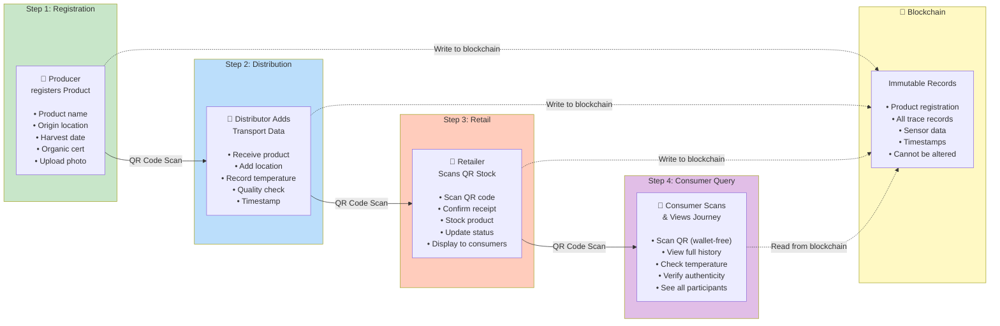

# Business Flow Diagram

**Purpose**: Complete supply chain journey from Producer to Consumer

**Use Cases**:
- Kickoff meeting presentation
- Explaining system to non-technical stakeholders
- Thesis Chapter 1 (Introduction)
- Demo videos

---

## Supply Chain Journey (4 Steps + Blockchain)

---

## Key Features Demonstrated

### 1. QR Code-Based Tracking
- Each product gets unique QR code at registration
- Same QR code used throughout entire journey
- Simple scan connects to blockchain data

### 2. Multi-Role System
- **Producer** (Wallet): Registers product, generates QR
- **Distributor** (Wallet): Adds transport data, temperature logs
- **Retailer** (Wallet): Confirms receipt, stocks product
- **Consumer** (No Wallet): Views complete journey, wallet-free access

### 3. Blockchain Integration
- Solid lines (→): Physical QR code scans
- Dotted lines (-.->): Blockchain read/write operations
- All data immutable once written
- Transparent verification for consumers

### 4. Data Flow
- **Write operations**: Producer, Distributor, Retailer (requires MetaMask wallet)
- **Read operations**: Consumer (wallet-free, just scan QR)
- **Storage**: Critical data on-chain, metadata off-chain (hybrid approach)

---

## Example Product Journey

**Product**: Organic Blueberries from Northern Finland

1. **Producer (Hirsimäki Farm)**:
   - Registers: "Organic Wild Blueberries, Yli-Ii, Finland"
   - Harvest date: July 15, 2025
   - Uploads photo of blueberries
   - Blockchain records: Product ID #001
   - QR code printed on packaging

2. **Distributor (Oulu Logistics)**:
   - Scans QR code at pickup
   - Records: "Received July 16, 2025, 06:00"
   - Temperature during transport: 2-4°C (cold chain maintained)
   - Location: En route to Helsinki
   - Blockchain records: Trace #001-002

3. **Retailer (K-Market Helsinki)**:
   - Scans QR code at delivery
   - Records: "Stocked July 17, 2025, 15:00"
   - Location: Refrigerated section
   - Product available for sale
   - Blockchain records: Trace #001-003

4. **Consumer (Sanna, Helsinki resident)**:
   - Scans QR code in store with smartphone
   - Sees complete journey: Farm → Transport → Store
   - Views temperature history: All readings 2-4°C ✅
   - Verifies organic certification
   - Trusts product authenticity
   - NO wallet or registration required

---

## Presentation Script

**For Kickoff Meeting (2-3 minutes):**

"Let me walk you through how a consumer would experience this system:

1. **At the farm**: Producer registers organic blueberries, blockchain creates permanent record, QR code generated
2. **During transport**: Distributor scans QR, adds location and temperature data to blockchain
3. **At the store**: Retailer scans QR, confirms product stocked
4. **Consumer experience**: Scan QR with phone → instantly see complete journey from farm to shelf → verify authenticity → NO wallet needed

The key innovation is **wallet-free consumer access**. Traditional blockchain apps require crypto wallets, creating friction. Our system solves this: businesses use wallets (Producer, Distributor, Retailer), but consumers just scan and view."

---

## Technical Implementation Notes

**QR Code Libraries**:
- Generation: `react-qr-code` (npm package)
- Scanning: `html5-qrcode` (works on iOS/Android browsers)
- Format: QR encodes Product ID → links to `/products/[id]` page

**Blockchain Transactions**:
- `registerProduct()` - Producer creates product (Gas: <100k)
- `addTraceRecord()` - Distributor/Retailer add records (Gas: <80k)
- `addSensorData()` - Temperature/humidity logs (Gas: <60k)

**Wallet Requirements**:
- Producer, Distributor, Retailer: MetaMask required (RainbowKit UI)
- Consumer: No wallet, reads from blockchain via API

---

## Diagram Export

**For Excalidraw**:
1. Copy entire Mermaid code block above
2. Paste into Excalidraw canvas
3. Excalidraw will auto-render

**For Thesis Document**:
1. Open https://mermaid.live/
2. Paste Mermaid code
3. Export as PNG (300 DPI for print quality)
4. Insert into thesis Chapter 1 or Chapter 4

**For Presentation Slides**:
1. Export as SVG (scalable, no pixelation)
2. Import into PowerPoint/Google Slides
3. Use for thesis defense presentation

---

**Last Updated**: November 10, 2025
**Created by**: Sam Chou
**Session**: Diagram optimization for kickoff meeting
