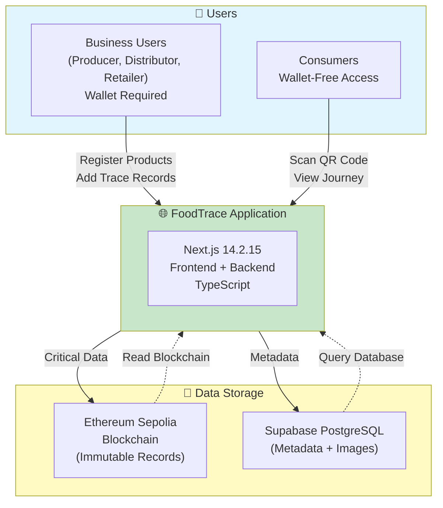

# System Overview Diagram

**Purpose**: Simplified high-level view for quick understanding

**Use Cases**:
- Kickoff meeting opening (first 2 minutes)
- Executive summary explanations
- Quick reference for non-technical stakeholders
- Thesis Chapter 1.5 (Thesis Structure overview)

---

## High-Level System Overview (Cleanest Version)



---

## Simplified Component Description

### 1. Users (2 Types)

**Business Users** (Wallet Required):
- **Producer**: Registers harvested products, uploads photos, generates QR codes
- **Distributor**: Receives products, adds transport data (location, temperature)
- **Retailer**: Stocks products, updates status to "Sold"
- **Requirement**: MetaMask wallet (to sign blockchain transactions)

**Consumers** (Wallet-Free):
- Scan QR code with smartphone camera
- View complete product journey (farm → transport → retail)
- Check temperature history and verification status
- NO wallet, NO registration, NO app download required

---

### 2. FoodTrace Application (Monolith)

**Technology**: Next.js 14.2.15 (Frontend + Backend together)

**Key Features**:
- 4 role-specific dashboards (Producer, Distributor, Retailer, Consumer)
- QR code generation and scanning
- IoT sensor data simulation (temperature, humidity, GPS)
- Blockchain transaction signing (via Wagmi v2)
- Image upload and storage

**Why Monolith**: Simpler deployment, no CORS issues, perfect for 12-week thesis timeline

---

### 3. Data Storage (Hybrid Approach)

**Ethereum Sepolia Blockchain** (On-Chain):
- **Stores**: Product IDs, timestamps, creator addresses, critical events
- **Why**: Immutable, transparent, cryptographically secure
- **Trade-off**: Expensive (gas costs), slower writes (~12-15 seconds per block)

**Supabase PostgreSQL** (Off-Chain):
- **Stores**: Product descriptions, images, cached blockchain data, sensor metadata
- **Why**: Fast queries, large file support, cheap storage
- **Trade-off**: Centralized (trust in Supabase), but combined with blockchain = hybrid security

---

## Key Innovation: Wallet-Free Consumer Access

**The Problem**: Traditional blockchain apps require crypto wallets (MetaMask) → major adoption barrier

**Our Solution**:
1. Producer registers product → blockchain records immutable data
2. QR code generated → links to Product ID
3. Consumer scans QR → opens public webpage
4. Webpage queries blockchain (read-only, no wallet needed)
5. Consumer sees complete journey + blockchain proof

**Result**: 100% transparency with ZERO friction for end consumers

---

## Data Flow (Simplified)

```text
Producer
  └─> Registers product (with wallet)
      └─> Blockchain: Immutable record created
      └─> Database: Metadata + image saved
      └─> QR code generated

Distributor
  └─> Scans QR code (with wallet)
      └─> Adds trace record (location, temperature)
      └─> Blockchain: Transport data recorded
      └─> Database: Cached for fast queries

Retailer
  └─> Scans QR code (with wallet)
      └─> Updates status to "Stocked"
      └─> Blockchain: Retail record added
      └─> Database: Final status updated

Consumer
  └─> Scans QR code (NO wallet)
      └─> Views product journey (public webpage)
      └─> Queries blockchain (read-only)
      └─> Sees complete transparency
```

---

## System Benefits

### For Businesses (Producer, Distributor, Retailer)

✅ **Immutable Records**: Data cannot be altered or deleted
✅ **Audit Trail**: Complete history of all transactions
✅ **Quality Assurance**: Temperature monitoring prevents spoilage
✅ **Reputation Building**: Verified products increase trust
✅ **Simple Interface**: Email/password login (no complex wallet setup)

### For Consumers

✅ **Complete Transparency**: See product journey from farm to shelf
✅ **Zero Friction**: No wallet, no registration, no app download
✅ **Instant Verification**: Scan QR code → see history in seconds
✅ **Trust Indicators**: Verification badges, temperature logs, blockchain proof
✅ **Mobile-Friendly**: Works on any smartphone browser (iOS/Android)

### For System (Technical)

✅ **Hybrid Storage**: Balance blockchain security with database speed
✅ **Cost-Efficient**: Testnet deployment (€0 cost for thesis)
✅ **Scalable Architecture**: Can upgrade to Hyperledger Fabric for production
✅ **Test Coverage**: >70% smart contract test coverage target
✅ **Performance**: <3 second page load, <2 second blockchain queries

---

## Technology Stack Summary

| Layer | Technology | Version | Purpose |
|-------|-----------|---------|---------|
| **Frontend** | Next.js | 14.2.15 | React framework (Pages Router) |
| **Language** | TypeScript | 5.8+ | Type safety |
| **UI Library** | Chakra UI | v2 | Accessible components |
| **Web3** | Wagmi + Viem | v2 | Blockchain integration |
| **Smart Contracts** | Solidity | ^0.8.20 | Ethereum contracts |
| **Testing** | Hardhat | Latest | Smart contract testing |
| **Database** | Supabase | PostgreSQL | Off-chain data |
| **ORM** | Prisma | Latest | Type-safe queries |
| **Blockchain** | Ethereum Sepolia | Testnet | Public blockchain |
| **Hosting** | Render.com | Node.js | Application deployment |

---

## Project Timeline (12 Weeks)

| Phase | Duration | Focus | Deliverables |
|-------|----------|-------|--------------|
| **Planning** | Week 1-2 | Architecture, PRD, Design | Complete system specification |
| **Smart Contracts** | Week 3-4 | Solidity development | Deployed contracts, >70% test coverage |
| **Frontend** | Week 5-7 | UI implementation | 4-role dashboards, QR functionality |
| **Testing** | Week 8 | Integration testing | Bug fixes, performance optimization |
| **Polish** | Week 9 | Documentation, demo | Complete POC, demo video |
| **Thesis** | Week 10-12 | Academic writing | 60+ page thesis, poster, presentation |

---

## Example Use Case: Organic Blueberries

**Product**: Organic Wild Blueberries from Northern Finland

**Journey**:

1. **Producer** (Hirsimäki Farm, Yli-Ii):
   - Registers: "Organic Wild Blueberries, Yli-Ii, Finland"
   - Harvest date: July 15, 2025
   - Uploads photo of blueberries
   - Blockchain records: Product ID #001
   - QR code printed on packaging

2. **Distributor** (Oulu Logistics):
   - Scans QR code at pickup
   - Records: "Received July 16, 2025, 06:00"
   - Temperature during transport: 2-4°C (cold chain maintained)
   - Location: En route to Helsinki
   - Blockchain records: Trace #001-002

3. **Retailer** (K-Market Helsinki):
   - Scans QR code at delivery
   - Records: "Stocked July 17, 2025, 15:00"
   - Location: Refrigerated section
   - Product available for sale
   - Blockchain records: Trace #001-003

4. **Consumer** (Sanna, Helsinki resident):
   - Scans QR code in store with smartphone
   - Sees complete journey: Farm → Transport → Store
   - Views temperature history: All readings 2-4°C ✅
   - Verifies organic certification
   - Trusts product authenticity
   - NO wallet or registration required

---

## Diagram Export Instructions

**For Excalidraw**:
1. Copy entire Mermaid code block above
2. Paste into Excalidraw canvas
3. Excalidraw will auto-render
4. Manually adjust colors if needed

**For Thesis Document**:
1. Open https://mermaid.live/
2. Paste Mermaid code
3. Export as PNG (300 DPI for print quality)
4. Insert into thesis Chapter 1 (Introduction) or Executive Summary

**For Presentation Slides**:
1. Export as SVG (scalable, no pixelation)
2. Import into PowerPoint/Google Slides
3. Use for opening slide (first 2 minutes of presentation)

---

## Presentation Script (Quick Overview)

**For Kickoff Meeting (2 minutes):**

"Welcome! Let me quickly explain FoodTrace:

**The Problem**: Current food supply chains lack transparency. Tracing a product back to its origin takes days, and consumers can't verify authenticity.

**Our Solution**: Blockchain-based traceability system with 4 roles:

**Business Users** (Producer, Distributor, Retailer) use wallets to register products and add trace records. Each action is recorded on Ethereum blockchain - immutable and transparent.

**Consumers** scan QR codes with their phones to see the complete product journey. NO wallet required - just scan and view. This is our key innovation: 100% transparency with ZERO friction.

**Technology**: Built with Next.js for the application, Ethereum Sepolia blockchain for immutable records, and Supabase PostgreSQL for metadata. Hybrid storage approach - critical data on-chain, details off-chain.

**Timeline**: 12 weeks - 9 weeks development, 3 weeks thesis writing. Currently in Week 0, kickoff meeting today.

**Questions?**"

---

## Comparison with Traditional Systems

| Feature | FoodTrace (Blockchain) | Traditional (Paper/Database) |
|---------|----------------------|--------------------------|
| **Data Immutability** | ✅ Guaranteed | ❌ Can be altered |
| **Traceability Speed** | ✅ ~2 seconds | ❌ ~7 days (Walmart case) |
| **Consumer Access** | ✅ Wallet-free QR scan | ❌ No access |
| **Transparency** | ✅ Public verification | ❌ Closed system |
| **Trust Model** | ✅ Decentralized proof | ❌ Single authority |
| **Setup Cost** | ⚠️ Higher initial | ✅ Lower |
| **Running Cost** | ⚠️ Gas fees (testnet free) | ✅ Lower |
| **Technical Complexity** | ⚠️ High | ✅ Low |
| **Audit Trail** | ✅ Permanent | ⚠️ Can be lost |

---

## Academic Justification

**Research Question**: How suitable is Ethereum blockchain for food supply chain traceability?

**Thesis Contribution**:
- Demonstrates technical feasibility of blockchain traceability
- Solves wallet-free consumer access challenge
- Compares Ethereum vs traditional systems
- Documents IoT integration approach (simulated data)
- Provides performance benchmarks and cost analysis
- Discusses limitations (GIGO problem, scalability challenges)

**Target Audience**: IT professor with blockchain knowledge, thesis supervisors, academic reviewers

---

**Last Updated**: November 10, 2025
**Created by**: Sam Chou
**Session**: Diagram optimization for kickoff meeting
