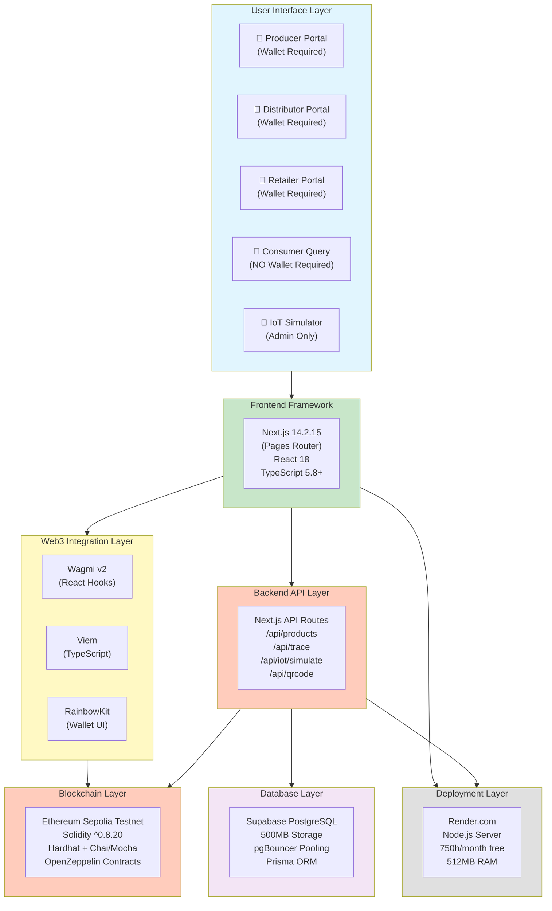

# Technical Architecture Diagram

**Purpose**: Complete technical stack with exact versions and layer-by-layer breakdown

**Use Cases**:
- Technical deep-dive discussions with professor
- Development reference for team (Weeks 3-9)
- Thesis Chapter 3.4 (Architecture) and Chapter 4 (Implementation)
- Answering technical questions during kickoff meeting

---

## Complete Technical Stack (7 Layers)



---

## Layer-by-Layer Technical Details

### 1. User Interface Layer (5 Portals)

**Producer Portal** (Wallet Required):
- Product registration form with photo upload
- QR code generation and download
- Product dashboard (list view, history)
- Built with Chakra UI v2 components

**Distributor Portal** (Wallet Required):
- Receive products (scan QR or manual entry)
- Add trace records (location, temperature, quality notes)
- Update product status
- View transport history

**Retailer Portal** (Wallet Required):
- Scan QR to receive products
- Stock products in system
- Update status to "Stocked" or "Sold"
- View product journey history

**Consumer Query** (NO Wallet Required):
- Scan QR code with smartphone camera (html5-qrcode)
- View complete product journey
- See temperature history and verification status
- Link to Etherscan for blockchain proof
- Zero-friction access (key innovation)

**IoT Simulator** (Admin Only):
- Generate realistic sensor data (temperature, humidity, GPS)
- Three scenarios: Normal (2-4°C), Warning (8-10°C), Critical (>10°C)
- Auto-mode for continuous data generation
- Simulates real MQTT sensor behavior

---

### 2. Frontend Framework (Next.js 14.2.15)

**Why Next.js 14.2.15 (not 15.x)**:
- Stable version (1+ year in production)
- React 18 ecosystem mature
- Better compatibility with Chakra UI v2
- Proven reliability for thesis project

**Why Pages Router (not App Router)**:
- Battle-tested architecture
- Team familiarity (all 3 members know Pages Router)
- No React Server Components complexity
- Simpler mental model for 12-week timeline

**Key Libraries**:
- **Chakra UI v2**: Component library with accessibility-first design
- **react-qr-code**: QR code generation (PNG, SVG download)
- **html5-qrcode**: QR code scanning (works on iOS/Android browsers)
- **TypeScript 5.8+**: Type safety, IntelliSense support

---

### 3. Web3 Integration Layer

**Wagmi v2** (React Hooks for Ethereum):
- `useAccount()` - Wallet connection status
- `useContractWrite()` - Send blockchain transactions
- `useContractRead()` - Query blockchain data
- `useWaitForTransaction()` - Transaction confirmation
- `useContractEvent()` - Listen for blockchain events

**Viem** (TypeScript Ethereum Library):
- Smaller bundle size than ethers.js
- Better TypeScript support (type inference)
- Modern, clean API
- Used by Wagmi v2 under the hood

**RainbowKit** (Wallet Connection UI):
- Pre-built wallet connection modal
- Support for MetaMask, WalletConnect, Coinbase Wallet
- Customizable themes
- Mobile-responsive design

---

### 4. Backend API Layer (Next.js API Routes)

**API Endpoints**:
- `/api/products` - Product metadata CRUD operations
- `/api/trace` - Add trace records, query history
- `/api/iot/simulate` - IoT simulator data endpoint
- `/api/qrcode` - QR code generation
- `/api/verify` - Verification status queries

**Why Next.js API Routes**:
- Same codebase as frontend (monolith architecture)
- No CORS issues (same origin)
- Simpler deployment (one Render.com instance)
- TypeScript end-to-end

---

### 5. Database Layer (Supabase PostgreSQL)

**Why Supabase (not vanilla PostgreSQL)**:
- Built-in pgBouncer connection pooling (CRITICAL for serverless)
- Prevents connection exhaustion (60 concurrent connections limit)
- Free tier generous enough (500MB storage, 2GB bandwidth/month)
- Integrated storage with CDN (for product images)

**Prisma ORM**:
- Type-safe database queries
- Auto-generated types from schema
- Migration management
- Connection pooling support

**Database Tables** (Off-Chain Data):
- `products` - Product metadata, descriptions, images
- `trace_records` - Cached blockchain data for faster queries
- `sensor_readings` - IoT simulator data
- `alerts` - Temperature/humidity violation alerts

---

### 6. Blockchain Layer (Ethereum Sepolia)

**Smart Contracts (Solidity ^0.8.20)**:
- `ProductRegistry.sol` - Product registration, immutable records
- `TraceRecords.sol` - Supply chain tracking, timestamped events
- `IOTSensorData.sol` - Sensor data storage, alert thresholds
- `AccessControl.sol` - Role-based permissions (Producer, Distributor, Retailer)

**Development Framework (Hardhat)**:
- Contract compilation (`npx hardhat compile`)
- Local blockchain testing (`npx hardhat node`)
- Automated testing (Chai + Mocha, >70% coverage target)
- Sepolia testnet deployment (`npx hardhat run scripts/deploy.ts --network sepolia`)
- Contract verification on Etherscan

**OpenZeppelin Contracts**:
- `AccessControl.sol` - Role-based access control (RBAC)
- `ReentrancyGuard.sol` - Prevent reentrancy attacks
- `Pausable.sol` - Emergency stop mechanism

**Gas Optimization Targets**:
- Product registration: <100k gas
- Trace record addition: <80k gas
- Sensor data recording: <60k gas

---

### 7. Deployment Layer (Render.com)

**Why Render.com (not Vercel)**:
- Traditional Node.js server (NOT serverless)
- No cold starts (always-on during free tier hours)
- 750 hours/month free tier (sufficient for thesis)
- Better WebSocket support (if needed for future IoT)
- Simpler environment variable management

**Deployment Configuration**:
- Build command: `npm run build`
- Start command: `npm start`
- Node.js version: 18.x LTS
- RAM: 512MB (sufficient for Next.js)
- Environment: Production (NODE_ENV=production)

---

## Data Flow Examples

### 1. Product Registration Flow

```text
Producer (Browser)
  → Fills form (name, origin, harvest date, photo)
  → Uploads to Supabase Storage (image)
  → Calls /api/products/register
    → Saves metadata to Supabase PostgreSQL
    → Signs transaction with Wagmi
      → Calls ProductRegistry.registerProduct()
        → Ethereum Sepolia records immutable data
        → Emits ProductRegistered event
      → QR code generated (react-qr-code)
      → Returns Product ID to frontend
    → Producer downloads QR code PNG
```

### 2. Consumer Query Flow (Wallet-Free)

```text
Consumer (Smartphone)
  → Scans QR code (html5-qrcode)
  → Opens /products/[id] page (public route, no auth)
    → Fetches product metadata from Supabase (fast cache)
    → Queries blockchain for trace history (Wagmi useContractRead)
    → Queries sensor data from Supabase
    → Displays complete product journey
    → Shows temperature history chart
    → Links to Etherscan for blockchain proof
  → Consumer sees full transparency (no wallet needed!)
```

### 3. IoT Simulator Flow

```text
Admin (Browser)
  → Opens IoT Simulator page
  → Selects product from dropdown
  → Clicks "Critical" scenario button (>10°C)
    → Generates realistic sensor data
      → Temperature: 12.5°C (above threshold)
      → Humidity: 85%
      → GPS: Simulated transport location
      → Timestamp: Current time
    → Calls /api/iot/simulate
      → Saves to Supabase SensorReading table
      → Checks alert thresholds
        → Temperature >10°C → Creates CRITICAL alert
      → Calls smart contract addSensorData()
        → Ethereum Sepolia records sensor reading
        → Emits SensorDataRecorded event
      → Returns alert notification to admin
    → Admin sees real-time data preview
```

---

## Key Architectural Decisions

### 1. Next.js Monolith (vs Microservices)

**Chosen**: Next.js Monolith
**Rationale**:
- Simpler deployment (one Render.com instance)
- No CORS issues (same origin)
- Team efficiency (all 3 members know Next.js)
- Cost: €0 vs. €15/month for separate backend
- Perfect for 12-week POC timeline

**Trade-off**: Less scalable for production, but sufficient for thesis demonstration.

---

### 2. IoT Simulator (vs Real Hardware)

**Chosen**: IoT Simulator (Admin Interface)
**Rationale**:
- Cost savings: €150-200 saved (Raspberry Pi + sensors)
- Reliability: No sensor failures during thesis presentation
- Testing speed: Instant data generation (no waiting for sensor intervals)
- Reproducibility: Can test edge cases (extreme temperatures)
- Academic validity: Standard practice in POC development (IBM Food Trust uses test harnesses)

**Trade-off**: Not real-world conditions, but architecture supports future migration to real MQTT sensors.

---

### 3. Render.com (vs Vercel)

**Chosen**: Render.com (Node.js Server)
**Rationale**:
- Traditional Node.js server (no serverless cold starts)
- Better for future IoT (WebSocket support)
- 750 hours/month free tier (31 days × 24 hours = 744 hours)
- Simpler environment variable management

**Trade-off**: Less Asia CDN optimization than Vercel, but team is in Finland (Europe datacenter fine).

---

### 4. Supabase (vs Vanilla PostgreSQL)

**Chosen**: Supabase (PostgreSQL with pgBouncer)
**Rationale**:
- Built-in connection pooling (prevents serverless connection exhaustion)
- Free tier generous enough (500MB storage)
- Integrated storage with CDN (for images)
- 15-minute setup vs. 2 hours for manual pooling

**Trade-off**: Vendor lock-in, but easy to migrate (standard PostgreSQL).

---

### 5. Ethereum Sepolia (vs Hyperledger Fabric)

**Chosen**: Ethereum Sepolia Testnet
**Rationale**:
- Educational accessibility (extensive free learning resources)
- Larger student/developer community
- JavaScript-based tooling (Hardhat) matches team skillset
- Public blockchain transparency (demonstrates immutability)
- €0 cost (testnet is free)

**Trade-off**: Hyperledger Fabric better for production B2B, but Ethereum perfect for 12-week academic POC.

---

## Performance Targets

| Metric | Target | Measurement Method |
|--------|--------|-------------------|
| **Page Load Time** | <3 seconds | Chrome DevTools |
| **API Response Time** | <500ms (p95) | Server logs |
| **Blockchain Query Time** | <2 seconds | Frontend timer |
| **First Load JS** | <250 KB | Next.js build analyzer |
| **QR Scan Success Rate** | >95% | User testing |
| **Test Coverage** | >70% | `npx hardhat coverage` |
| **Gas Cost (Registration)** | <100k gas | Hardhat gas reporter |

---

## Security Considerations

**Smart Contract Security**:
- OpenZeppelin AccessControl (role-based permissions)
- ReentrancyGuard (prevent reentrancy attacks)
- Input validation (reject future dates, empty strings)
- Gas limit checks (prevent DoS)

**Backend Security**:
- Environment variables (.env.local, never committed to Git)
- Supabase Row Level Security (RLS) for tenant isolation
- API rate limiting (100 requests/minute per IP)
- Input sanitization (SQL injection prevention via Prisma)

**Frontend Security**:
- HTTPS only (Render.com automatic SSL)
- Content Security Policy (CSP) headers
- No private keys in browser (read-only consumer access)
- QR code validation (prevent malicious QR codes)

---

## Diagram Export Instructions

**For Excalidraw**:
1. Copy entire Mermaid code block above
2. Paste into Excalidraw canvas
3. Excalidraw will auto-render
4. Manually adjust layout if needed (Mermaid auto-layout not perfect)

**For Thesis Document**:
1. Open https://mermaid.live/
2. Paste Mermaid code
3. Export as PNG (300 DPI for print quality)
4. Insert into thesis Chapter 3.4 (Architecture) or Chapter 4 (Implementation)

**For Presentation Slides**:
1. Export as SVG (scalable, no pixelation)
2. Import into PowerPoint/Google Slides
3. Use for technical deep-dive section (5 minutes)

---

## Presentation Script (Technical Deep-Dive)

**For Kickoff Meeting (5-7 minutes):**

"Let me walk you through the complete technical architecture:

**Layer 1 - User Interface**: We have 5 portals - Producer, Distributor, Retailer register products with wallets. Consumers query without wallets (key innovation!). Admin runs IoT simulator.

**Layer 2 - Frontend**: Built with Next.js 14.2.15 Pages Router, React 18, TypeScript 5.8+. Stable, proven stack. Chakra UI v2 for accessible components.

**Layer 3 - Web3 Integration**: Wagmi v2 hooks for blockchain interaction. Viem for TypeScript Ethereum support. RainbowKit for wallet UI. This layer connects our React app to the blockchain.

**Layer 4 - Backend**: Next.js API Routes. Monolith architecture - frontend and backend together. Simpler deployment, no CORS issues. Perfect for 12-week timeline.

**Layer 5 - Database**: Supabase PostgreSQL with pgBouncer connection pooling. Critical for preventing connection exhaustion. Stores off-chain data: images, descriptions, cached blockchain queries. 500MB free tier sufficient.

**Layer 6 - Blockchain**: Ethereum Sepolia testnet. Solidity ^0.8.20 smart contracts. Hardhat for testing (>70% coverage target). OpenZeppelin for security. Public blockchain transparency demonstrates immutability concept.

**Layer 7 - Deployment**: Render.com with Node.js server. NOT serverless - no cold starts. 750 hours/month free tier. Better WebSocket support for future IoT.

**Key Innovation**: Hybrid storage - critical data on-chain (immutable), metadata off-chain (cheap). Consumer access wallet-free via QR codes.

**Questions?**"

---

**Last Updated**: November 10, 2025
**Created by**: Sam Chou
**Session**: Diagram optimization for kickoff meeting
