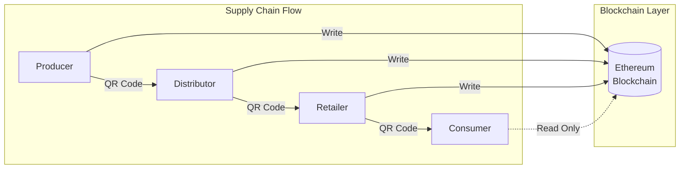

# Chapter 1: INTRODUCTION

This chapter establishes the foundation for this thesis by introducing blockchain technology's application in food supply chain traceability. It begins with the background and research gap addressing the accessibility-decentralization trade-off in blockchain implementations (Section 1.1), defines the central problem of mainstream blockchain adoption (Section 1.2), and outlines the research objectives and questions guiding this proof-of-concept system (Section 1.3). The chapter concludes by specifying the scope and limitations of this educational project (Section 1.4) and providing an overview of the eight-chapter thesis structure (Section 1.5).

## 1.1 Background

Blockchain technology, introduced by Nakamoto (2008) with Bitcoin, has evolved beyond cryptocurrency to enable transparent, immutable record-keeping through smart contracts—self-executing programs deployed on decentralized networks. While blockchain's cryptographic guarantees (immutability, transparency, Byzantine fault tolerance) theoretically address supply chain traceability challenges, practical adoption faces significant barriers: user experience complexity, transaction costs, and scalability limitations (Buterin, 2014; Wood, 2014).

Food supply chains exemplify these challenges. Traditional centralized systems rely on intermediaries and paper-based tracking, creating information asymmetries and slow response times. Blockchain implementations like IBM Food Trust have demonstrated dramatic traceability improvements, reducing query times from days to seconds (Kamath, 2018)—showing blockchain's capability for rapid consensus across distributed stakeholders.

However, existing blockchain supply chain implementations face a critical trade-off between accessibility and decentralization. Enterprise solutions like IBM Food Trust provide user-friendly interfaces but rely on permissioned blockchains controlled by centralized gatekeepers, undermining public verifiability (Hyperledger Foundation case study, 2019). Conversely, public blockchain applications (Ethereum DApps) offer true decentralization but suffer from wallet complexity barriers that exclude mainstream users (Voskobojnikov et al., 2021). This creates a "crypto-native vs mainstream user" divide limiting adoption beyond technical enthusiasts.

Current research lacks solutions balancing transparency benefits of public blockchains with accessibility requirements for mass adoption. Recent systematic reviews reveal an enterprise-dominant focus with limited attention to small producer needs and consumer accessibility (Ellahi et al., 2024). Moreover, wallet-based access remains the dominant pattern, creating adoption barriers for end consumers who simply want to verify product authenticity without installing cryptocurrency software. This thesis addresses this gap by demonstrating how Ethereum public blockchain can enable transparent supply chain tracking with wallet-free consumer access, targeting the 570 million small-scale farms globally (FAO, 2023) underserved by enterprise consortium models.

Figure 1 illustrates the FoodTrace system overview, showing how products flow through the four-role supply chain while blockchain provides the immutable data layer.

*Figure 1 FoodTrace system overview showing 4-role supply chain flow and blockchain integration*

<!-- Mermaid diagram for Excalidraw - export as PNG for Word -->

---

## 1.2 Problem Statement

The central problem addressed is: **How can blockchain technology be made accessible to mainstream users while preserving its core benefits of decentralization, transparency, and immutability?**

This manifests in food supply chain traceability through four interconnected challenges summarized in Table 1.

*Table 1 Key challenges in blockchain-based food supply chain traceability*

| Challenge | Description |
|-----------|-------------|
| User Experience | Wallet setup and management complexity deters mainstream adoption |
| Transaction Costs | Ethereum mainnet gas fees vary with congestion, often exceeding viability for low-margin products |
| Oracle Problem | Blockchain ensures data immutability but cannot verify off-chain data accuracy ("garbage in, garbage out") |
| Platform Selection | Trade-offs between public blockchain (Ethereum) and permissioned alternatives (Hyperledger Fabric) lack clear guidance |

---

## 1.3 Objectives & Research Questions

### 1.3.1 Main Objective

**"Design, implement, and evaluate a proof-of-concept blockchain-based food traceability system demonstrating how Ethereum smart contracts can provide transparent, immutable supply chain tracking while addressing mainstream accessibility through wallet-free consumer access and hybrid data architecture."**

This objective emphasizes four dimensions: (1) technical demonstration through smart contracts, Web3 architecture, and hybrid storage; (2) accessibility innovation via the wallet-free consumer pattern; (3) real-world validation using a 4-role supply chain from Producer to Consumer; and (4) critical evaluation including performance analysis and limitations documentation.

### 1.3.2 Specific Objectives

This thesis implements a proof-of-concept system with five key components outlined in Table 2.

*Table 2 Specific objectives and system components*

| Objective | Component | Deliverable |
|-----------|-----------|-------------|
| SO1 | Smart Contracts | Role-based permissions deployed to Ethereum Sepolia testnet |
| SO2 | Consumer Interface | Wallet-free product verification via QR codes |
| SO3 | Data Architecture | Hybrid on-chain/off-chain storage balancing immutability with efficiency |
| SO4 | Web Application | Four-role dashboards (Producer, Distributor, Retailer, Consumer) |
| SO5 | Platform Analysis | Comparative evaluation of Ethereum vs Hyperledger Fabric |

*Note: IoT sensor integration was originally planned but deferred to future work due to time constraints. See Chapter 8 for proposed design.*

### 1.3.3 Research Questions

**RQ1: Technical Suitability**
_How suitable is Ethereum blockchain for food supply chain traceability in proof-of-concept implementations?_

**RQ2: Comparative Analysis**
_What are the technical advantages and limitations of blockchain-based traceability compared to traditional centralized database approaches?_

**RQ3: Transparency vs Privacy Trade-offs**
_How can blockchain applications balance public verification requirements with business data privacy needs?_

**RQ4: Accessibility Innovation**
_How can user experience challenges (wallet management, transaction complexity) be addressed to enable broader blockchain adoption?_

**RQ5: Small Producer Feasibility**
_What is the feasibility of deploying blockchain traceability for small-scale producers, and what barriers exist?_

---

## 1.4 Scope & Limitations

This **proof-of-concept (POC)** system uses Ethereum Sepolia testnet (not mainnet—zero real costs), Next.js 14.2.15 + React + TypeScript frontend, Solidity ^0.8.20 smart contracts with Hardhat framework, and Supabase (PostgreSQL) for off-chain metadata. The simplified 4-role supply chain model (Producer, Distributor, Retailer, Consumer) focuses on one product category for demonstration.

**Key limitations acknowledged:** Testnet deployment means gas costs estimated not experienced; IoT sensor integration deferred to future work (see Chapter 8); limited scalability testing (3-wallet scenario, not high-volume production); no formal security audit or enterprise system integration; 12-week timeline prevents long-term deployment validation. These limitations are justified by educational focus, budget constraints (zero-cost requirement), and time constraints appropriate for bachelor's thesis scope. Detailed limitation implications discussed in Chapter 7.

---

## 1.5 Thesis Structure

This thesis progresses through eight chapters:
**Chapter 1** establishes blockchain technology context, research problem, and objectives.
**Chapter 2** reviews literature on blockchain fundamentals, Ethereum vs Hyperledger Fabric, smart contract design patterns, and Web3 UX challenges.
**Chapter 3** explains BMAD methodology, platform selection justification, technical architecture design, and testing approach.
**Chapter 4** details smart contract implementation (Solidity, OpenZeppelin, role-based access control).
**Chapter 5** covers system implementation (backend API development, frontend interfaces, Web3 integration).
**Chapter 6** presents test results (coverage analysis, performance metrics, gas cost measurements).
**Chapter 7** discusses findings, evaluates blockchain advantages and limitations (scalability, oracle problem, scope reduction decisions), and recommends production deployment strategies.
**Chapter 8** concludes by answering research questions, positioning technical contributions, and proposing future work (gas optimization, IoT sensors, Layer 2 scaling).

---

## References for Chapter 1

Buterin, V. (2014). _Ethereum: A next-generation smart contract and decentralized application platform_. Ethereum Foundation. https://ethereum.org/whitepaper

Ellahi, R. M., Wood, L. C., & Bekhit, A. E. A. (2024). Blockchain-driven food supply chains: A systematic review for unexplored opportunities. _Applied Sciences_, 14(19), 8944. https://doi.org/10.3390/app14198944

Food and Agriculture Organization (FAO). (2023). _Small family farms country factsheet_. Retrieved from https://www.fao.org/family-farming

Hyperledger Foundation. (2019). _Walmart and IBM Food Trust Case Study_. Hyperledger Foundation Case Studies. Retrieved from https://www.hyperledger.org/case-studies/walmart

Kamath, R. (2018). Food traceability on blockchain: Walmart's pork and mango pilots with IBM. _The Journal of the British Blockchain Association_, 1(1), 1-12. https://doi.org/10.31585/jbba-1-1-(10)2018

Nakamoto, S. (2008). _Bitcoin: A peer-to-peer electronic cash system_. https://bitcoin.org/bitcoin.pdf

Springer. (2025). Digital transformation of food supply chain management using blockchain: A systematic literature review. _Business & Information Systems Engineering_. https://doi.org/10.1007/s12599-025-00948-0

Voskobojnikov, A., Wiese, O., Mehrabi Koushki, M., Roth, V., & Beznosov, K. (2021). The U in crypto stands for usable: An empirical study of user experience with mobile cryptocurrency wallets. _CHI '21: CHI Conference on Human Factors in Computing Systems_. https://doi.org/10.1145/3411764.3445407

Wood, G. (2014). _Ethereum: A secure decentralised generalised transaction ledger_. Ethereum Foundation. https://ethereum.github.io/yellowpaper/paper.pdf

---

**Word Count:** ~1,250 words (Target: 1,200 | Tables: 2 | Figures: 1)

**Session 78 Changes (2025-12-09):**
- Converted Section 1.2 bullet list → Table 1
- Converted Section 1.3.1 bullet list → numbered prose
- Converted Section 1.3.2 bullet list → Table 2
- Added Figure 1 (Mermaid diagram for Excalidraw)
- Total bullet points removed: 13
