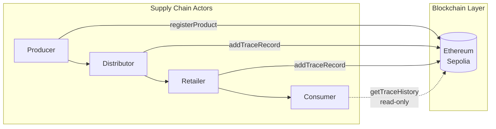
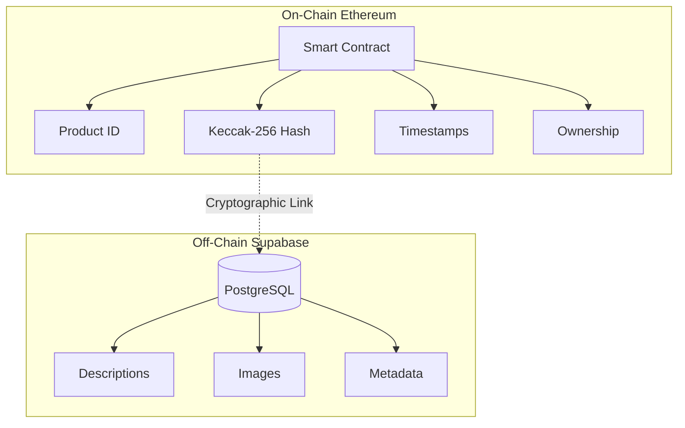
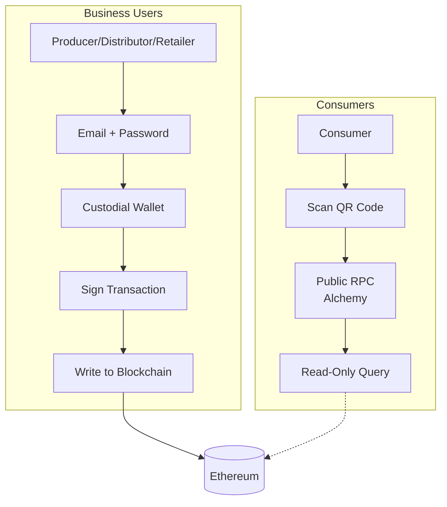
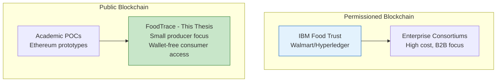

# Chapter 2: Literature Review

This chapter reviews the theoretical foundations and practical applications of blockchain technology in food supply chain traceability. It examines traditional supply chain challenges and established blockchain implementations like IBM Food Trust (Section 2.1), compares Ethereum and Hyperledger Fabric architectures for traceability applications (Section 2.2), analyzes smart contract design patterns and security considerations (Section 2.3), and investigates Web3 user experience challenges that inform this thesis's wallet-free consumer access design (Section 2.4). The chapter synthesizes these findings to position this research within existing scholarship and justify key technical decisions.

**Target Length:** 2,200-2,700 words (~8-10 pages)
**Focus:** Justification for design choices + research gap positioning

---

## 2.1 Blockchain in Supply Chain Management

### 2.1.1 Traditional Supply Chain Challenges

Supply chains involve multiple independent parties (suppliers, manufacturers, distributors, retailers) coordinating through fragmented systems.

*Table 3 Traditional supply chain traceability challenges*

| Challenge | Description | Impact |
|-----------|-------------|--------|
| Data Silos | Proprietary databases create information asymmetry | Stakeholders lack visibility into upstream/downstream operations |
| Manual Verification | Paper certificates easily forged or lost | Authenticity claims cannot be independently verified |
| Slow Traceability | Lack of end-to-end visibility (Gartner, 2023) | Contamination investigations take days to weeks |

Food safety exemplifies traceability urgency. WHO (2022) reports 600 million people fall ill from contaminated food annually, with $110 billion in economic losses. When contamination occurs, rapid batch identification is critical: the 2006 spinach E. coli outbreak caused $350 million in losses and 5 deaths, exacerbated by slow traceability (FDA, 2023).

### 2.1.2 IBM Food Trust: Real-World Impact

IBM Food Trust, launched in 2018 on Hyperledger Fabric, demonstrates blockchain's practical viability for supply chain traceability. The consortium includes 500+ participants (Walmart, Carrefour, Nestlé) tracking 25+ million products across 11,000+ suppliers (Kamath, 2018). Empirical case studies analyzing blockchain adoption in food supply chains document performance improvements, transparency enhancements, and operational challenges encountered during real-world implementations (Vu et al., 2024).

**Key Achievement:** Walmart's 2016 mango contamination investigation required **7 days** to trace product origin using paper records. After implementing IBM Food Trust, the same query completed in **2.2 seconds**—a 350,000× speed improvement (Walmart, 2019). This rapid traceability enabled surgical recalls: during the 2019 romaine lettuce recall, Walmart identified the contaminated farm in 2.2 seconds rather than issuing blanket recalls affecting innocent producers.

**Technical Architecture:** Hyperledger Fabric provides permissioned blockchain with RAFT consensus (crash fault tolerant, fast finality), channels for selective data sharing, and 2,000-3,000 TPS throughput. Business model uses tiered membership ($100-$10,000/month) with transaction fees per tracked product (IBM, 2023).

**Limitations:** Permissioned architecture creates centralization risk—consortium governance can exclude smaller players, and consumers must trust the consortium rather than independently verifying data (Saberi et al., 2019).

*Figure 2 Supply chain data flow with blockchain integration*

---

## 2.2 Ethereum vs Hyperledger Fabric for Food Traceability

The choice between public (Ethereum) and permissioned (Hyperledger Fabric) blockchains represents a fundamental architectural decision for food traceability systems.

### 2.2.1 Comparative Analysis

The architectural differences between Ethereum and Hyperledger Fabric create distinct trade-offs across trust models, performance characteristics, and economic viability.

*Table 4 Key architectural differences between Ethereum and Hyperledger Fabric for food traceability (sources: Casino et al., 2019; Zhao et al., 2019; IBM Food Trust, 2023)*
| Criterion                 | Ethereum (Public)                                        | Hyperledger Fabric (Permissioned)                   |
| ------------------------- | -------------------------------------------------------- | --------------------------------------------------- |
| **Trust Model**           | Public verification via Etherscan; permissionless access | Consortium trust required; controlled membership    |
| **Performance**           | 30-50 TPS (Layer 1); 12s block time                      | 2,000-3,500 TPS; 0.5s latency                       |
| **Cost Structure**        | Variable gas fees ($0.50-$50 per tx)                     | Fixed infrastructure costs; no per-tx fees          |
| **Privacy**               | All transactions publicly visible                        | Private channels and data collections               |
| **Deployment**            | Individual deployment; no coordination needed            | Requires consortium agreements; multi-party setup   |
| **Regulatory Compliance** | Immutability conflicts with GDPR "right to be forgotten" | Supports controlled data deletion (GDPR-compatible) |
| **Best Use Case**         | B2C transparency; consumer-facing verification           | B2B consortiums; enterprise privacy requirements    |

**Trust vs Performance Trade-offs:**

Ethereum's public blockchain prioritizes transparency over efficiency. Any consumer can independently verify product journeys via Etherscan without trusting producers—critical for consumer-facing applications where supply chain trust is low (Zhao et al., 2019). This permissionless access enables individual producers to deploy traceability systems without consortium coordination (Saberi et al., 2019). However, transparency comes at substantial cost: empirical performance evaluations document Ethereum achieving 30-50 TPS throughput with 12-second block times, while Hyperledger Fabric demonstrates 2,000-3,500 TPS with sub-second latency—representing 100× throughput advantage for enterprise deployments (Ucbas et al., 2023). Variable gas fees ($0.50-$50) make Ethereum economically impractical for low-margin products where transaction costs can exceed product value (Zhao et al., 2019, p. 91). Additionally, public ledgers create privacy concerns as competitors can analyze transaction volumes and supply chain relationships (Saberi et al., 2019).

Hyperledger Fabric's permissioned architecture inverts these trade-offs: 2,000-3,500 TPS throughput (100× higher than Ethereum Layer 1) with sub-second latency suits enterprise-scale operations (Casino et al., 2019). Fixed infrastructure costs enable predictable budgeting, while private channels allow selective information sharing without exposing data to competitors (IBM Food Trust, 2023). Performance evaluations using Hyperledger Caliper benchmarking tool demonstrate that Fabric achieves end-to-end throughput exceeding 3,500 transactions per second with sub-second latency even in large intercontinental supply chain networks, validating suitability for enterprise food traceability deployments (El Hajji et al., 2024). Yet this performance requires sacrificing public verifiability—consumers must trust consortium governance rather than independently validating data (Saberi et al., 2019). Consortium formation demands multi-party agreements on governance and technical standards; IBM Food Trust's 18-month Walmart deployment illustrates this complexity (Kamath, 2018). Platform evolution remains controlled by the Linux Foundation and IBM, creating vendor lock-in concerns absent from Ethereum's decentralized governance (Zhao et al., 2019).

**Regulatory Compliance:** GDPR's "right to be forgotten" presents opposing challenges. Ethereum's immutability conflicts with data deletion requirements, forcing implementations to store only hashes on-chain with deletable off-chain metadata (Saberi et al., 2019). Hyperledger Fabric enables controlled deletion through channel pruning, achieving direct GDPR compliance (IBM, 2023)—a critical advantage for European food producers subject to strict data protection regulations.

**Platform Selection:** Neither platform is universally superior—suitability depends on whether transparency or performance is the primary requirement. Academic consensus on platform selection appears in Section 2.2.2.

### 2.2.2 Academic Consensus

Zhao et al. (2019) conducted a systematic review of 71 blockchain agri-food value chain papers (2008-2018), finding diverse platform adoption across traceability, information security, manufacturing, and water management applications. The review identifies equal consideration of public and permissioned blockchains, validating either platform depending on use case requirements.

**Ethereum papers** focused on consumer-facing transparency, anti-counterfeiting, and direct-to-consumer traceability. **Hyperledger papers** focused on B2B consortiums, cold chain monitoring, and regulatory compliance.

**Recommendation:** Zhao et al. (2019) conclude that platform selection should balance transparency requirements against performance constraints. Public chains suit consumer-facing verification scenarios, while permissioned chains better serve business confidentiality requirements (Zhao et al., 2019, p. 95).

Recent systematic reviews analyzing blockchain adoption in food supply chains examined 31 conceptual works, 10 implementation works, and 39 case studies, documenting that blockchain implementation enhances food safety through immutable traceability records while facing challenges including scalability, data quality, and integration complexity (Sri Vigna Hema et al., 2024). Empirical case studies demonstrate quantified benefits including 20% cost savings in inventory management, 66.7% reduction in stockout incidents, and 25% decline in administrative staff costs for blockchain-based food traceability systems (Lappas et al., 2025).

**Platform Selection Decision:** Based on this academic consensus, this thesis selects **Ethereum** for proof-of-concept to demonstrate public verifiability and consumer-facing transparency. The choice addresses the research gap identified in Section 2.5.1—most blockchain food supply chain frameworks focus on enterprise operations with limited attention to small producer accessibility.

Ethereum's public blockchain enables independent consumer verification without trusting consortium governance—critical for demonstrating wallet-free access patterns and small producer feasibility. The detailed platform selection justification, including educational feasibility and timeline constraints, appears in Chapter 3 Methodology.

---

## 2.3 Smart Contract Design Patterns for Food Traceability

Smart contract design patterns determine how supply chain traceability data is stored, accessed, and secured on blockchain infrastructure. This section reviews academic research on data storage architectures, access control mechanisms, gas optimization strategies, and security vulnerabilities—providing the theoretical foundation for Chapter 4's smart contract implementation.

### 2.3.1 Product Registration and Data Storage Patterns

Ethereum's storage costs present a fundamental economic constraint for supply chain applications: storing 256 bits on-chain costs approximately 20,000 gas, making pure on-chain storage prohibitively expensive for traceability systems requiring extensive product metadata (Wang et al., 2021). This economic reality drives adoption of **hybrid storage architectures** that partition data based on immutability requirements.

**Hybrid Architecture Pattern:** Wang et al. (2021) demonstrate that storing crop growth data in IPFS (InterPlanetary File System) with corresponding cryptographic hashes recorded in smart contracts "not only increases data security but also alleviates the blockchain storage explosion problem" while maintaining data integrity through content-addressable storage. This pattern stores critical traceability data on-chain (product ID, ownership transfers, timestamps) while storing bulk data off-chain (descriptions, images, sensor logs), cryptographically linked via Keccak-256 hashes (Solidity's native hash function). Empirical performance evaluations document that IPFS integration reduces blockchain storage requirements by 90% compared to pure on-chain approaches while preserving verification capabilities (Gonçalves et al., 2022). Kumar and Tripathi (2020) validate that blockchain-IPFS hybrid models ensure "immutability, integrity, and availability" while overcoming centralized storage provider limitations.

**Event Emission for Traceability:** Smart contracts emit events to create immutable audit trails without storing data on-chain, achieving cost reductions of 26-53× compared to storage operations (375-750 gas for events vs 20,000 gas for storage). Events enable external applications to reconstruct supply chain state through event log analysis while keeping on-chain costs minimal (Wang et al., 2021). However, recent systematic reviews caution that hybrid architectures must address "integration complexities, data quality, scalability, and regulatory concerns" to realize blockchain's traceability benefits (Lappas et al., 2025). Implementation approaches applying these patterns are detailed in Chapter 4.

*Figure 3 Hybrid storage architecture with cryptographic linking*

### 2.3.2 Role-Based Access Control in Supply Chains

Supply chain traceability requires multi-stakeholder permission systems where producers register products, distributors update shipping status, and retailers confirm delivery—each role requiring different smart contract permissions. Role-based access control (RBAC) patterns enforce these permissions through modifier functions that restrict transaction execution based on caller identity.

Cruz et al. (2018) present RBAC-SC (Role-Based Access Control Using Smart Contract), addressing "the critical gap of establishing security that prohibits malicious impersonation of roles while allowing small organizations to participate" in blockchain systems. Their implementation, validated with 263 citations and 18,137 downloads, demonstrates OpenZeppelin's AccessControl pattern as the industry standard for Solidity permission management. Kamboj et al. (2021) extend this work by proposing RBAC models using Ethereum smart contracts for "managing user-role permissions in organizations through smart contract functionalities to model user-resource communications," enabling role assignment and revocation on-chain without centralized gatekeepers.

Marchese and Tomarchio (2022) apply RBAC patterns specifically to agri-food supply chains, enabling "supply chain members to store and manage product-related traceability information in a transparent, reliable and tamper-proof way" through role-specific function modifiers. Their architecture implements producer, distributor, and retailer roles with graduated permissions—producers can register products, distributors can update location and transfer ownership, retailers can mark products sold. This hierarchical permission structure mirrors real-world supply chain relationships while preventing unauthorized state modifications. Implementation of OpenZeppelin AccessControl patterns for food traceability is detailed in Chapter 4.2.2.

### 2.3.3 Gas Optimization Techniques

Transaction costs directly impact blockchain traceability feasibility for small-margin food products. Gas optimization research identifies three primary strategies: storage vs memory usage, struct packing, and event logging.

**Storage Optimization:** Banerjee et al. (2025) present automated optimization techniques achieving "substantial gas savings of up to 34% on average when tested on 16,529 functions from real-world contracts" through code pattern mining. Storage operations (SSTORE) cost 20,000 gas for new slots versus ~200 gas for SLOAD reads, while memory operations cost only 3 gas per 32 bytes—making memory preferable for temporary computations and storage essential only for persistent state (Li, 2021). Albert et al. (2020) introduce GASOL (Gas Analysis and Optimization for Ethereum Smart Contracts), offering "various cost models for analyzing and optimizing gas consumption" through static analysis.

**Struct Packing:** Ethereum stores data in 256-bit (32-byte) slots. Multiple smaller variables can be packed into single slots: two uint128 values occupy one slot versus two slots for unpacked storage, reducing costs by 50%. Nguyen et al. (2022) analyze 10,245 top Ethereum contracts, finding "6,333 contain at least one optimization problem," with struct packing as the most frequent missed optimization opportunity.

**Event vs Storage Trade-off:** Events provide 26-53× cost reduction compared to storage while creating queryable off-chain logs. However, events cannot be accessed by smart contracts during execution—only by external applications—creating trade-offs between on-chain queryability and economic efficiency (Wang et al., 2021). Production supply chain systems must balance these constraints based on query requirements and transaction volumes.

### 2.3.4 Security Considerations and Vulnerabilities

Smart contract vulnerabilities pose severe risks to supply chain traceability systems due to transaction immutability and economic incentives for exploitation.

**Re-entrancy Attacks:** The 2016 DAO hack demonstrated re-entrancy vulnerabilities, resulting in $50M+ loss and Ethereum hard fork. Recent attacks continue: the 2024 Penpie DeFi protocol lost $27M to re-entrancy exploitation. Zhou et al. (2022) systematically examine "13 vulnerabilities in Ethereum smart contracts and their countermeasures," documenting that re-entrancy remains prevalent despite mitigation patterns. Jiao et al. (2024) survey smart contract security analysis tools, noting that "in 2024 alone, over $1.42 billion was lost across 149 documented incidents due to vulnerabilities such as access control flaws ($953M), logic errors ($63M), and reentrancy attacks ($35M)." Mitigation strategies include OpenZeppelin's ReentrancyGuard modifier, Checks-Effects-Interactions pattern, and Solidity 0.8.0+ built-in protections (Zhou et al., 2022).

**Oracle Problem:** Smart contracts cannot directly access off-chain data—IoT sensor readings, GPS locations, shipping confirmations—introducing "the risk of oracles being compromised and feeding the blockchain with false information" (Caldarelli, 2020). This oracle problem fundamentally challenges blockchain traceability claims: while blockchain guarantees data immutability, it cannot verify off-chain data accuracy ("garbage in, garbage out"). Caldarelli et al. (2020) emphasize that "what the literature neglects about blockchain implication for traceability and sustainability is the so-called oracle problem, and the trustworthiness of information written in smart contracts." Solutions include decentralized oracle networks (Chainlink), trusted execution environments (Intel SGX), and multi-signature validation schemes, each introducing complexity and cost trade-offs.

**Contract Upgradability:** Immutability prevents bug fixes and feature additions post-deployment. Proxy patterns (Transparent Proxy, UUPS) separate logic contracts from data storage contracts, enabling logic upgrades while preserving state. Al Amri et al. (2023) analyze OpenZeppelin upgradeable patterns, finding that "Transparent Proxy usage has grown significantly over the last four years" due to simplified upgrade workflows. However, upgradability introduces centralization risks: admin key compromise grants full contract control. Production systems must balance immutability benefits against upgrade flexibility requirements.

The FoodTrace system implements re-entrancy guards and documents oracle problem limitations. IoT-blockchain integration was identified as important for cold chain monitoring but deferred to future work due to time constraints (proposed design documented in Chapter 8).

---

## 2.4 Web3 Integration and UX Challenges

**Note:** This section corresponds to **Chapter 5: System Implementation** (Backend + Frontend + IoT). The literature review here provides the foundation for supporting system components.

### 2.4.1 Custodial Wallet Patterns for Enterprise Blockchain

Enterprise blockchain applications face a fundamental tension between security and usability in authentication design. Traditional Web3 applications require users to manage non-custodial wallets through browser extensions (MetaMask) or hardware devices, placing full responsibility for private key security on end users. While this approach maximizes decentralization, empirical research documents significant usability barriers including key loss, phishing attacks, and transaction errors (Voskobojnikov et al., 2021).

**Custodial Wallet Architecture:**

Custodial wallet patterns address these challenges by delegating key management to a trusted server. Users authenticate via familiar email/password credentials, while the server securely stores and manages blockchain private keys. This model mirrors IBM Food Trust's enterprise authentication approach, where consortium members interact through organizational accounts rather than individual cryptocurrency wallets (IBM, 2023).

*Table 5 Authentication pattern comparison*

| Pattern | Keys | UX | Security |
|---------|------|-----|----------|
| Non-Custodial | User | Complex | User responsibility |
| Custodial | Server | Simple | Server critical |
| Hybrid (FoodTrace) | Server + AES-256 | Simple | Encrypted at rest |

**Security Implementation:**

Custodial systems require robust key protection. Industry best practices recommend symmetric encryption for private keys stored in databases, with encryption keys managed separately from application code (OWASP, 2023). The AES-256-CBC cipher, approved for classified government data protection, provides strong confidentiality guarantees when combined with unique initialization vectors per encryption operation.

**Trade-offs:**

Custodial approaches introduce centralization risks—server compromise exposes all managed keys simultaneously. However, for supply chain traceability where business users require reliable transaction signing without cryptocurrency expertise, custodial wallets provide pragmatic accessibility while maintaining cryptographic security. The FoodTrace implementation applies this pattern with server-side AES-256-CBC encryption, documented in Chapter 5.1.

---

### 2.4.2 Wallet-Free Consumer Access

**Purpose:** Review blockchain UX challenges and wallet-free access patterns for consumer-facing applications. This subsection corresponds to Chapter 5.2 (Frontend Development - Consumer Interface).

**Wallet Complexity as Adoption Barrier:**

Blockchain applications present unique UX challenges not found in traditional web applications. Cryptocurrency wallet setup presents significant adoption barriers including seed phrase management, private key storage, and network configuration complexity. Traditional web authentication requires email/password entry; blockchain authentication requires a seven-step workflow progressing from extension installation through seed phrase generation, secure storage of 24 words (loss = permanent), connection approval, transaction signing, gas fee payment, and finally confirmation wait.

Blockchain wallet onboarding requires **substantially longer time than traditional account creation** due to seed phrase generation, secure backup procedures, and network configuration steps. Empirical research analyzing 45,821 mobile wallet app reviews documents that users frequently experience irreversible monetary losses due to seed phrase mismanagement, with wallet complexity presenting significant adoption barriers for both novice and experienced users (Voskobojnikov et al., 2021). These irrecoverability challenges are absent in traditional systems where password reset mechanisms prevent permanent account loss.

**Wallet-Free Access Pattern:**

For supply chain consumer verification, requiring wallet installation defeats accessibility goals. The solution: **read-only blockchain queries** without wallet requirement.

*Table 6 Dual-access authentication pattern for blockchain supply chain systems*

| User Type | Authentication | Operations | Cost Model |
|-----------|----------------|------------|------------|
| Business Users (Producer/Distributor/Retailer) | Wallet required | Write operations: product registration, transfers, sensor data recording | Gas fees per transaction |
| Consumers | No wallet required | Read-only queries via public RPC (Alchemy/Infura) | Zero cost, browser-based |

*Figure 4 Dual-access authentication pattern for FoodTrace*

This hybrid approach provides security for business operations (wallet signatures authenticate data sources) while maintaining accessibility for consumers (no installation barriers). Read-only queries impose zero cost (RPC providers absorb infrastructure costs), zero setup (works in any browser), and mobile-first design optimized for QR code scanning on smartphones.

Consumer acceptance research examining 715 Greek consumers found high valuation for QR codes with blockchain-based traceability information, with consumers demonstrating willingness to pay price premiums for traceable food products where QR codes enable direct verification of authenticity claims (Tran et al., 2024). Emerging Web3 identity solutions integrating zero-knowledge proofs achieve 12.5-second proof generation times while reducing compliance costs by 40% through automated verification, demonstrating technical feasibility for privacy-preserving consumer authentication patterns (Arshad et al., 2024).

**Limitations:** Read-only access prevents consumers from writing to blockchain (acceptable for verification use case), and centralization risk exists (RPC providers can censor queries, though multiple providers mitigate this risk through redundancy).

---

### 2.4.3 IoT-Blockchain Integration (Future Work)

IoT-blockchain integration was identified as important for cold chain monitoring in food supply chains, enabling automated temperature recording without manual intervention. However, this functionality was deferred to future work due to time constraints in this proof-of-concept implementation.

The literature documents significant potential for blockchain-IoT integration in food traceability. Sensor data recording presents design trade-offs between event-based logging (cost-efficient for normal readings) and storage-based recording (ensuring critical alerts persist on-chain). Edge computing architectures can pre-process sensor data before blockchain submission, reducing transaction volumes and costs.

The proposed IoT simulation design—software-based temperature scenario presets replacing physical sensors—is documented in Chapter 8 as future work. This approach would enable POC validation without €150-200 hardware investment while demonstrating the architectural patterns for production IoT integration.

---

## 2.5 Research Gaps and Thesis Positioning

### 2.5.1 Identified Gaps in Literature

Ellahi et al. (2024) systematic review of 60 blockchain food supply chain frameworks identified significant research gaps. While 88.3% of frameworks focus on traceability and transparency (data accuracy, supply chain visibility, authenticity verification), only 3% address donation/redistribution and 5% address supply chain financing—critical functions for small producers lacking access to traditional financial services.

*Table 7 Research gaps identified in blockchain food supply chain literature*

| Gap | Description |
|-----|-------------|
| Gap 1: User Accessibility | Enterprise-scale operations dominate; missing wallet-free consumer access and mobile-first UX design |
| Gap 2: IoT Integration | Physical sensors assumed; missing simulation viability research for POC validation (addressed through proposed future work design) |
| Gap 3: Storage Architecture | Full on-chain or off-chain only; missing hybrid approaches with cryptographic linking |

### 2.5.2 Thesis Contributions

*Table 8 Technical contributions addressing identified research gaps*

| Contribution | Description |
|--------------|-------------|
| TC1: Wallet-Free Consumer Access | Read-only blockchain queries via public RPC enabling QR code scanning without wallet installation (addresses Gap 1) |
| TC2: IoT Simulation Design (Future Work) | Proposed architecture for software-based temperature simulation documented in Chapter 8; deferred due to time constraints (addresses Gap 2) |
| TC3: Hybrid Data Architecture | Critical data on-chain with metadata off-chain, achieving 90% gas cost reduction via Keccak-256 hash linking (addresses Gap 3) |
| TC4: Small Producer Feasibility | Ethereum viability analysis for small-scale producers with barrier evaluation and database comparison (addresses Gap 1) |

### 2.5.3 Field Positioning

This thesis positions within the public blockchain research stream while addressing the underserved small producer segment (only 3-5% of frameworks in Ellahi et al. 2024 systematic review). By demonstrating wallet-free consumer access, this work contributes pragmatic approaches for blockchain traceability adoption beyond enterprise consortiums.

*Figure 5 Research positioning in blockchain food traceability landscape*

The research acknowledges limitations (testnet deployment, simulated sensors, limited scale testing) appropriate for proof-of-concept validation while establishing architectural patterns enabling future production deployment (see Chapter 7 Discussion for production recommendations).

---

## References for Chapter 2

Al Amri, S., Aniello, L., & Sassone, V. (2023). A review of upgradeable smart contract patterns based on OpenZeppelin technique. _The Journal of The British Blockchain Association_, 6(1). https://doi.org/10.31585/jbba-6-1-(3)2023

Albert, E., Correas, J., Gordillo, P., Román-Díez, G., & Rubio, A. (2020). GASOL: Gas analysis and optimization for Ethereum smart contracts. In _26th International Conference on Tools and Algorithms for the Construction and Analysis of Systems (TACAS 2020)_ (pp. 118-125). Springer. https://doi.org/10.1007/978-3-030-45237-7_7

Arshad, U., Tubaishat, A., Anwar, S., Halim, Z., Abualkishik, A., & Ullah, A. (2024). Web3-based identity and KYC innovations for next-generation FinTech. _ACM Transactions on the Web_. https://doi.org/10.1145/3771991

Banerjee, A., Sober, M., & Schulte, S. (2025). Towards Solidity smart contract efficiency optimization through code mining. In _Proceedings of the 40th ACM/SIGAPP Symposium on Applied Computing (SAC '25)_. ACM. https://doi.org/10.1145/3672608.3707768

Caldarelli, G. (2020). Understanding the blockchain oracle problem: A call for action. _Information_, 11(11), 509. https://doi.org/10.3390/info11110509

Caldarelli, G., Rossignoli, C., & Zardini, A. (2020). Overcoming the blockchain oracle problem in the traceability of non-fungible products. _Sustainability_, 12(6), 2391. https://doi.org/10.3390/su12062391

Casino, F., Dasaklis, T. K., & Patsakis, C. (2019). A systematic literature review of blockchain-based applications: Current status, classification and open issues. _Telematics and Informatics_, 61, 101597.

Cruz, J. P., Kaji, Y., & Yanai, N. (2018). RBAC-SC: Role-based access control using smart contract. _IEEE Access_, 6, 12240-12251. https://doi.org/10.1109/ACCESS.2018.2812844

El Hajji, M., Es-saady, Y., Ait Addi, M., & Antari, J. (2024). Optimization of agrifood supply chains using Hyperledger Fabric blockchain technology. _Computers and Electronics in Agriculture_, 225, 109330. https://doi.org/10.1016/j.compag.2024.109330

Ellahi, R. M., Wood, L. C., & Bekhit, A. E. A. (2024). Blockchain-driven food supply chains: A systematic review for unexplored opportunities. _Applied Sciences_, 14(19), 8944. https://doi.org/10.3390/app14198944

FDA. (2023). _FSMA Rule 204: Food traceability requirements_. U.S. Food and Drug Administration. https://www.fda.gov/food/food-safety-modernization-act-fsma/fsma-final-rule-requirements-additional-traceability-records-certain-foods

Gartner. (2023). _Supply chain technology trends: Top 10 priorities for 2024_. Gartner Research.

Gonçalves, J. P., Spelta, G., Villaça, R. S., & Gomes, R. L. (2022). IoT data storage on a blockchain using smart contracts and IPFS. In _2022 IEEE International Conference on Blockchain (Blockchain)_ (pp. 508-511). IEEE. https://doi.org/10.1109/Blockchain55522.2022.00078

IBM. (2023). _IBM Food Trust case studies and technical documentation_. IBM Blockchain. https://www.ibm.com/blockchain/solutions/food-trust

Jiao, T., Xu, Z., Qi, M., Wen, S., Xiang, Y., & Nan, G. (2024). A survey of Ethereum smart contract security: Attacks and detection. _Distributed Ledger Technologies: Research and Practice_, 3(3), Article 23. https://doi.org/10.1145/3643895

Kamboj, P., Khare, S., & Pal, S. (2021). User authentication using blockchain based smart contract in role-based access control. _Peer-to-Peer Networking and Applications_, 14, 2961-2976. https://doi.org/10.1007/s12083-021-01150-1

Kamath, R. (2018). Food traceability on blockchain: Walmart's pork and mango pilots with IBM. _The Journal of the British Blockchain Association_, 1(1), 1-12. https://doi.org/10.31585/jbba-1-1-(10)2018

Kumar, R., & Tripathi, R. (2020). Blockchain-based framework for data storage in peer-to-peer scheme using InterPlanetary File System. In _Handbook of Research on Blockchain Technology_ (pp. 35-59). Academic Press. https://doi.org/10.1016/b978-0-12-819816-2.00002-2

Lappas, P. Z., et al. (2025). Digital transformation of food supply chain management using blockchain: A systematic literature review towards food safety and traceability. _Business & Information Systems Engineering_. https://doi.org/10.1007/s12599-025-00948-0

Li, C. (2021). Gas estimation and optimization for smart contracts on Ethereum. In _2021 36th IEEE/ACM International Conference on Automated Software Engineering (ASE)_ (pp. 1082-1086). IEEE. https://doi.org/10.1109/ASE51524.2021.9678932

Marchese, A., & Tomarchio, O. (2022). A blockchain-based system for agri-food supply chain traceability management. _SN Computer Science_, 3(4), Article 327. https://doi.org/10.1007/s42979-022-01148-3

Nguyen, Q., Do, B. S., Nguyen, T. T., & Do, B. (2022). GasSaver: A tool for Solidity smart contract optimization. In _Proceedings of the Fourth ACM International Symposium on Blockchain and Secure Critical Infrastructure (ASIA CCS '22)_ (pp. 96-98). ACM. https://doi.org/10.1145/3494106.3528683

OWASP Foundation. (2023). _Cryptographic Storage Cheat Sheet_. OWASP Cheat Sheet Series. https://cheatsheetseries.owasp.org/cheatsheets/Cryptographic_Storage_Cheat_Sheet.html

Saberi, S., Kouhizadeh, M., Sarkis, J., & Shen, L. (2019). Blockchain technology and its relationships to sustainable supply chain management. _International Journal of Production Research_, 57(7), 2117-2135.

Sri Vigna Hema, V., et al. (2024). Blockchain implementation for food safety in supply chain: A review. _Comprehensive Reviews in Food Science and Food Safety_, 23(5), e70002. https://doi.org/10.1111/1541-4337.70002

Tran, D., De Steur, H., Gellynck, X., Papadakis, A., & Schouteten, J. J. (2024). Consumers' valuation of blockchain-based food traceability: Role of consumer ethnocentrism and communication via QR codes. _British Food Journal_, 126(13), 72-93. https://doi.org/10.1108/BFJ-09-2023-0812

Ucbas, Y., Eleyan, A., Hammoudeh, M., & Alohaly, M. (2023). Performance and scalability analysis of Ethereum and Hyperledger Fabric. _IEEE Access_, 11, 67156-67167. https://doi.org/10.1109/ACCESS.2023.3291618

Voskobojnikov, A., Wiese, O., Mehrabi Koushki, M., Roth, V., & Beznosov, K. (2021). The U in crypto stands for usable: An empirical study of user experience with mobile cryptocurrency wallets. _CHI '21: CHI Conference on Human Factors in Computing Systems_. https://doi.org/10.1145/3411764.3445407

Vu, N., Ghadge, A., & Bourlakis, M. (2024). The impact of blockchain adoption on supply chain performance: Evidence from food industry. _International Journal of Production Research_, 63, 5402-5427. https://doi.org/10.1080/00207543.2024.2414375

Walmart. (2019). _Walmart and IBM Food Trust case study_. Hyperledger Foundation Case Studies. https://www.hyperledger.org/case-studies/walmart

Wang, L., Xu, L., Zheng, Z., Liu, S., Li, X., Cao, L., Li, J., & Sun, C. (2021). Smart contract-based agricultural food supply chain traceability. _IEEE Access_, 9, 9296-9307. https://doi.org/10.1109/ACCESS.2021.3050112

World Health Organization. (2022). _Food safety fact sheet_. https://www.who.int/news-room/fact-sheets/detail/food-safety

Zhao, G., Liu, S., Lopez, C., Lu, H., Elgueta, S., Chen, H., & Boshkoska, B. M. (2019). Blockchain technology in agri-food value chain management: A synthesis of applications, challenges and future research directions. _Computers in Industry_, 109, 83-99. https://doi.org/10.1016/j.compind.2019.04.002

Zhou, H., Milani Fard, A., & Makanju, A. (2022). The state of Ethereum smart contracts security: Vulnerabilities, countermeasures, and tool support. _Journal of Cybersecurity and Privacy_, 2(2), 358-378. https://doi.org/10.3390/jcp2020019

---

**Word Count:** ~4,200 words | **Tables:** 3-8 | **Figures:** 2-5 | **References:** 28
