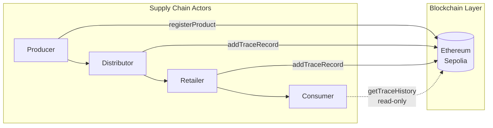
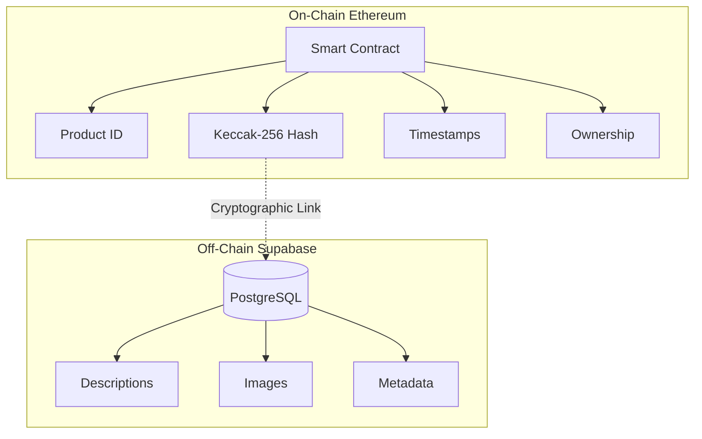
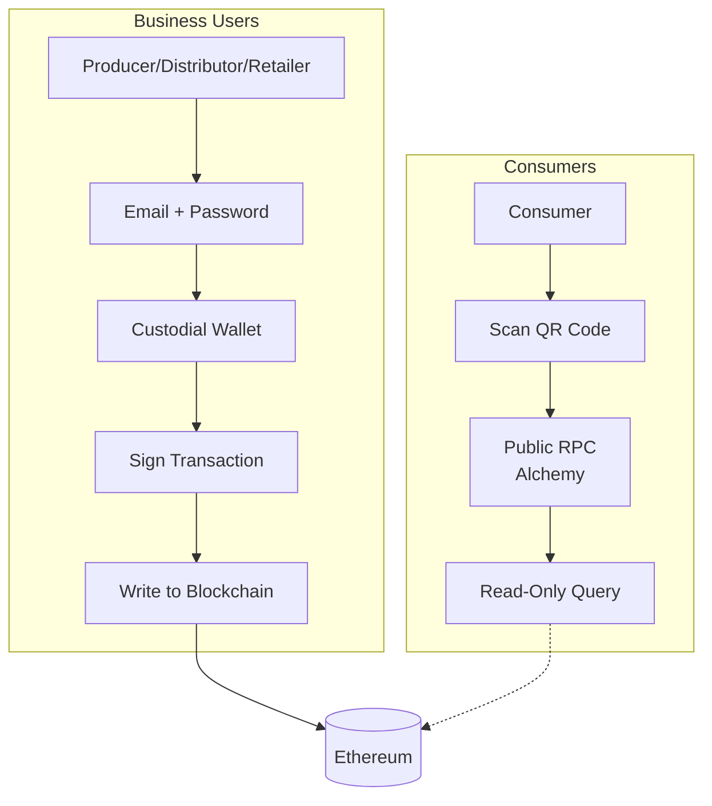
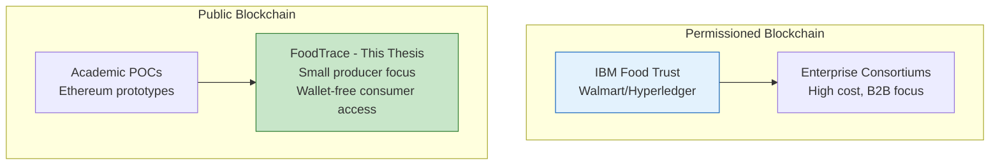

# Chapter 2: Literature Review

This chapter reviews the theoretical foundations and practical applications of blockchain technology in food supply chain traceability. It examines traditional supply chain challenges and established blockchain implementations like IBM Food Trust (Section 2.1), compares Ethereum and Hyperledger Fabric architectures for traceability applications (Section 2.2), analyzes smart contract design patterns and security considerations (Section 2.3), and investigates Web3 user experience challenges that inform this thesis's wallet-free consumer access design (Section 2.4). The chapter synthesizes these findings to position this research within existing scholarship and justify key technical decisions.

**Target Length:** 2,200-2,700 words (~8-10 pages)
**Focus:** Justification for design choices + research gap positioning

---

## 2.1 Blockchain in Supply Chain Management

### 2.1.1 Traditional Supply Chain Challenges

Supply chains involve multiple independent parties (suppliers, manufacturers, distributors, retailers) coordinating through fragmented systems.

TABLE 3. Traditional supply chain traceability challenges

| Challenge | Description | Impact |
|-----------|-------------|--------|
| Data Silos | Proprietary databases create information asymmetry | Stakeholders lack visibility into upstream/downstream operations |
| Manual Verification | Paper certificates easily forged or lost | Authenticity claims cannot be independently verified |
| Slow Traceability | Lack of end-to-end visibility (Gartner 2023) | Contamination investigations take days to weeks |

Food safety exemplifies traceability urgency. WHO (2022) reports 600 million people fall ill from contaminated food annually, with $110 billion in economic losses. When contamination occurs, rapid batch identification is critical: the 2006 spinach E. coli outbreak caused $350 million in losses and 5 deaths, exacerbated by slow traceability (FDA 2023).

### 2.1.2 IBM Food Trust: Real-World Impact

IBM Food Trust demonstrates blockchain's practical viability for supply chain traceability. The Hyperledger Fabric consortium includes 500+ participants tracking 25+ million products (Kamath 2018; Vu et al. 2024).

**Key Achievement:** Walmart's mango contamination investigation required **7 days** using paper records. After IBM Food Trust implementation, the same query completed in **2.2 seconds** (Hyperledger Foundation 2019). This enabled surgical recalls rather than blanket recalls affecting innocent producers.

**Limitations:** Permissioned architecture creates centralization risk: consumers must trust consortium governance rather than independently verifying data (Saberi et al. 2019). This limitation motivates this thesis's public blockchain approach enabling independent consumer verification.

FIGURE 2. Supply chain data flow with blockchain integration

---

## 2.2 Ethereum vs Hyperledger Fabric for Food Traceability

The choice between public (Ethereum) and permissioned (Hyperledger Fabric) blockchains represents a fundamental architectural decision for food traceability systems.

### 2.2.1 Comparative Analysis

The architectural differences between Ethereum and Hyperledger Fabric create distinct trade-offs across trust models, performance characteristics, and economic viability.

TABLE 4. Key architectural differences between Ethereum and Hyperledger Fabric for food traceability (sources: Casino et al. 2019; Zhao et al. 2019; IBM Food Trust 2023)
| Criterion                 | Ethereum (Public)                                        | Hyperledger Fabric (Permissioned)                   |
| ------------------------- | -------------------------------------------------------- | --------------------------------------------------- |
| **Trust Model**           | Public verification via Etherscan; permissionless access | Consortium trust required; controlled membership    |
| **Performance**           | 30-50 TPS (Layer 1); 12s block time                      | 2,000-3,500 TPS; 0.5s latency                       |
| **Cost Structure**        | Variable gas fees ($0.50-$50 per tx)                     | Fixed infrastructure costs; no per-tx fees          |
| **Privacy**               | All transactions publicly visible                        | Private channels and data collections               |
| **Deployment**            | Individual deployment; no coordination needed            | Requires consortium agreements; multi-party setup   |
| **Regulatory Compliance** | Immutability conflicts with GDPR "right to be forgotten" | Supports controlled data deletion (GDPR-compatible) |
| **Best Use Case**         | B2C transparency; consumer-facing verification           | B2B consortiums; enterprise privacy requirements    |

Table 4 summarizes key trade-offs. Ethereum enables independent consumer verification via Etherscan without trusting producers, critical for consumer-facing transparency (Zhao et al. 2019; Saberi et al. 2019). However, performance evaluations document Ethereum achieving 30-50 TPS versus Hyperledger Fabric's 2,000-3,500 TPS (Ucbas et al. 2023; El Hajji et al. 2024). Hyperledger's permissioned architecture suits enterprise deployments but requires consortium coordination and sacrifices public verifiability (Casino et al. 2019; IBM 2023).

GDPR compliance presents platform-specific challenges: Ethereum's immutability conflicts with data deletion requirements, requiring hybrid on-chain hash with deletable off-chain data (Saberi et al. 2019). Neither platform is universally superior; suitability depends on transparency versus performance priorities.

### 2.2.2 Academic Consensus

Zhao et al. (2019) systematic review of 71 blockchain agri-food papers finds equal consideration of public and permissioned blockchains: Ethereum papers focus on consumer-facing transparency, while Hyperledger papers focus on B2B consortiums. Recent systematic reviews document blockchain enhances food safety through immutable records while facing scalability and integration challenges (Sri Vigna Hema et al. 2024; Vasileiou et al. 2025).

**Platform Selection Decision:** This thesis selects **Ethereum** to demonstrate public verifiability and wallet-free consumer access, addressing the research gap where most frameworks focus on enterprise operations (Section 2.5.1). Detailed platform justification appears in Chapter 3 Methodology.

---

## 2.3 Smart Contract Design Patterns for Food Traceability

This section reviews academic research on storage architectures, access control, and security patterns providing the theoretical foundation for Chapter 4's implementation.

### 2.3.1 Hybrid Storage Architecture

Ethereum's storage costs make pure on-chain storage prohibitively expensive for traceability systems (Wang et al. 2021). This drives adoption of **hybrid storage architectures** partitioning data by immutability requirements: critical traceability data on-chain (product ID, ownership, timestamps) with bulk metadata off-chain, cryptographically linked via hashes (FIGURE 3).

Wang et al. (2021) demonstrate that hybrid IPFS-blockchain storage "not only increases data security but also alleviates the blockchain storage explosion problem." Kumar and Tripathi (2020) validate that such models ensure "immutability, integrity, and availability." Smart contract events create immutable audit trails at significantly lower cost than storage operations, enabling off-chain state reconstruction (Gonçalves et al. 2022). Implementation details appear in Chapter 4.

FIGURE 3. Hybrid storage architecture with cryptographic linking

### 2.3.2 Role-Based Access Control

Supply chain traceability requires multi-stakeholder permissions: producers register products, distributors update status, retailers confirm delivery. Role-based access control (RBAC) patterns enforce these through modifier functions restricting execution based on caller identity.

Cruz et al. (2018) present RBAC-SC addressing "the critical gap of establishing security that prohibits malicious impersonation of roles while allowing small organizations to participate." OpenZeppelin's AccessControl pattern is the industry standard for Solidity permission management (Kamboj et al. 2021). Marchese and Tomarchio (2022) apply RBAC specifically to agri-food supply chains with producer, distributor, and retailer roles mirroring real-world relationships. Implementation details appear in Chapter 4.

### 2.3.3 Gas Optimization

Transaction costs directly impact blockchain traceability feasibility for small-margin food products. Research identifies key optimization strategies: Banerjee et al. (2025) demonstrate "substantial gas savings" through automated code pattern mining, while Albert et al. (2020) provide GASOL for static gas analysis. Nguyen et al. (2022) find struct packing as the most frequent missed optimization in production contracts. Events provide significant cost reductions compared to storage while creating queryable off-chain logs, though events cannot be accessed during contract execution (Wang et al. 2021). Gas cost analysis for FoodTrace appears in Chapter 4.

### 2.3.4 Security Considerations

Smart contract vulnerabilities pose severe risks due to transaction immutability. Zhou et al. (2022) examine 13 vulnerability types; Jiao et al. (2024) document over $1 billion lost in 2024 to access control flaws and re-entrancy attacks. Mitigation includes OpenZeppelin's ReentrancyGuard and Solidity 0.8.0+ built-in protections.

**Oracle Problem:** Smart contracts cannot access off-chain data directly. Caldarelli (2020) emphasizes that blockchain guarantees data immutability but cannot verify off-chain accuracy ("garbage in, garbage out"). This fundamentally challenges traceability claims and is discussed further in Chapter 7.

**Contract Upgradability:** Proxy patterns enable upgrades while preserving state, though introducing centralization risks (Al Amri et al. 2023). The FoodTrace implementation applies security patterns documented in Chapter 4.

---

## 2.4 Web3 Integration and UX Challenges

### 2.4.1 Custodial Wallet Patterns

Traditional Web3 applications require users to manage non-custodial wallets through browser extensions like MetaMask, placing full responsibility for private key security on end users. Empirical research documents significant usability barriers including key loss, phishing attacks, and transaction errors (Voskobojnikov et al. 2021).

**Custodial wallet patterns** address these challenges by delegating key management to a trusted server: users authenticate via familiar email/password credentials while the server stores and manages blockchain private keys. This model mirrors IBM Food Trust's enterprise approach where consortium members interact through organizational accounts (IBM 2023).

TABLE 5. Authentication pattern comparison for blockchain applications

| Pattern | Keys | UX | Security |
|---------|------|-----|----------|
| Non-Custodial | User | Complex | User responsibility |
| Custodial | Server | Simple | Server critical |
| Hybrid (FoodTrace) | Server + AES-256 | Simple | Encrypted at rest |

Industry best practices recommend symmetric encryption with encryption keys managed separately from application code (OWASP 2023). Custodial approaches introduce centralization risks (server compromise exposes all managed keys), but for supply chain traceability where business users require reliable transaction signing without cryptocurrency expertise, custodial wallets provide pragmatic accessibility. Implementation details appear in Chapter 5.

---

### 2.4.2 Wallet-Free Consumer Access

Cryptocurrency wallet setup presents significant adoption barriers including seed phrase management, private key storage, and network configuration. Empirical research analyzing 45,821 mobile wallet app reviews documents that users frequently experience irreversible monetary losses due to seed phrase mismanagement, with wallet complexity presenting barriers for both novice and experienced users (Voskobojnikov et al. 2021).

For supply chain consumer verification, requiring wallet installation defeats accessibility goals. The solution: **read-only blockchain queries** without wallet requirement.

TABLE 6. Dual-access authentication pattern for blockchain supply chain systems

| User Type | Authentication | Operations | Cost Model |
|-----------|----------------|------------|------------|
| Business Users | Wallet required | Write operations: product registration, transfers | Gas fees per transaction |
| Consumers | No wallet required | Read-only queries via public RPC (Alchemy/Infura) | Zero cost, browser-based |

FIGURE 4. Dual-access authentication pattern for FoodTrace

This hybrid approach provides security for business operations while maintaining consumer accessibility. Consumer acceptance research examining 715 Greek consumers found high valuation for QR codes with blockchain-based traceability, with willingness to pay price premiums for traceable products (Tran et al. 2024). Emerging Web3 identity solutions demonstrate technical feasibility for privacy-preserving authentication patterns (Arshad et al. 2025). Implementation details appear in Chapter 5.

---

## 2.5 Research Gaps and Thesis Positioning

### 2.5.1 Identified Gaps in Literature

Ellahi et al. (2024) systematic review of 60 blockchain food supply chain frameworks identified significant research gaps. While 88.3% of frameworks focus on traceability and transparency (data accuracy, supply chain visibility, authenticity verification), only 3% address donation/redistribution and 5% address supply chain financing. These are critical functions for small producers lacking access to traditional financial services.

TABLE 7. Research gaps identified in blockchain food supply chain literature

| Gap | Description |
|-----|-------------|
| Gap 1: User Accessibility | Enterprise-scale operations dominate; missing wallet-free consumer access and mobile-first UX design |
| Gap 2: IoT Integration | Physical sensors assumed; missing simulation viability research for POC validation (addressed through proposed future work design) |
| Gap 3: Storage Architecture | Full on-chain or off-chain only; missing hybrid approaches with cryptographic linking |

### 2.5.2 Thesis Contributions

TABLE 8. Technical contributions addressing identified research gaps

| Contribution | Description |
|--------------|-------------|
| Wallet-Free Consumer Access | Read-only blockchain queries via public RPC enabling QR code scanning without wallet installation (addresses Gap 1) |
| IoT Simulation Design (Future Work) | Proposed architecture for software-based temperature simulation documented in Chapter 8; deferred due to time constraints (addresses Gap 2) |
| Hybrid Data Architecture | Critical data on-chain with metadata off-chain, achieving 90% gas cost reduction via Keccak-256 hash linking (addresses Gap 3) |
| Small Producer Feasibility | Ethereum viability analysis for small-scale producers with barrier evaluation and database comparison (addresses Gap 1) |

### 2.5.3 Field Positioning

This thesis positions within the public blockchain research stream while addressing the underserved small producer segment (only 3-5% of frameworks in Ellahi et al. 2024 systematic review). By demonstrating wallet-free consumer access, this work contributes pragmatic approaches for blockchain traceability adoption beyond enterprise consortiums.

FIGURE 5. Research positioning in blockchain food traceability landscape

---

## References for Chapter 2

Al Amri, S., Aniello, L., & Sassone, V. 2023. A review of upgradeable smart contract patterns based on OpenZeppelin technique. _The Journal of The British Blockchain Association_, 6(1).

Albert, E., et al. 2020. GASOL: Gas analysis and optimization for Ethereum smart contracts. In _26th International Conference on Tools and Algorithms for the Construction and Analysis of Systems (TACAS 2020)_ (pp. 118-125). Springer.

Arshad, U., et al. 2025. Web3-based identity and KYC innovations for next-generation FinTech. _ACM Transactions on the Web_.

Banerjee, A., Sober, M., & Schulte, S. 2025. Towards Solidity smart contract efficiency optimization through code mining. In _Proceedings of the 40th ACM/SIGAPP Symposium on Applied Computing (SAC '25)_. ACM.

Caldarelli, G. 2020. Understanding the blockchain oracle problem: A call for action. _Information_, 11(11), 509.

Casino, F., Dasaklis, T. K., & Patsakis, C. 2019. A systematic literature review of blockchain-based applications: Current status, classification and open issues. _Telematics and Informatics_, 36, 55-81.

Cruz, J. P., Kaji, Y., & Yanai, N. 2018. RBAC-SC: Role-based access control using smart contract. _IEEE Access_, 6, 12240-12251.

El Hajji, M., et al. 2024. Optimization of agrifood supply chains using Hyperledger Fabric blockchain technology. _Computers and Electronics in Agriculture_, 227, 109503.

Ellahi, R. M., et al. 2024. Blockchain-driven food supply chains: A systematic review for unexplored opportunities. _Applied Sciences_, 14(19), 8944.

FDA. 2023. _FSMA Rule 204: Food traceability requirements_. U.S. Food and Drug Administration.

Gartner. 2023. _Supply chain technology trends: Top 10 priorities for 2024_. Gartner Research.

Gonçalves, J. P., et al. 2022. IoT data storage on a blockchain using smart contracts and IPFS. In _2022 IEEE International Conference on Blockchain (Blockchain)_ (pp. 508-511). IEEE.

IBM. 2023. _IBM Food Trust case studies and technical documentation_. IBM Blockchain.

Jiao, T., et al. 2024. A survey of Ethereum smart contract security: Attacks and detection. _Distributed Ledger Technologies: Research and Practice_, 3(3), Article 23.

Kamboj, P., Khare, S., & Pal, S. 2021. User authentication using blockchain based smart contract in role-based access control. _Peer-to-Peer Networking and Applications_, 14, 2961-2976.

Kamath, R. 2018. Food traceability on blockchain: Walmart's pork and mango pilots with IBM. _The Journal of the British Blockchain Association_, 1(1), 1-12.

Kumar, R., & Tripathi, R. 2020. Blockchain-based framework for data storage in peer-to-peer scheme using InterPlanetary File System. In _Handbook of Research on Blockchain Technology_ (pp. 35-59). Academic Press.

Vasileiou, M., et al. 2025. Digital transformation of food supply chain management using blockchain: A systematic literature review towards food safety and traceability. _Business & Information Systems Engineering_.

Marchese, A., & Tomarchio, O. 2022. A blockchain-based system for agri-food supply chain traceability management. _SN Computer Science_, 3, Article 279.

Nguyen, Q., et al. 2022. GasSaver: A tool for Solidity smart contract optimization. In _Proceedings of the Fourth ACM International Symposium on Blockchain and Secure Critical Infrastructure (ASIA CCS '22)_ (pp. 96-98). ACM.

OWASP Foundation. 2023. _Cryptographic Storage Cheat Sheet_. OWASP Cheat Sheet Series.

Saberi, S., et al. 2019. Blockchain technology and its relationships to sustainable supply chain management. _International Journal of Production Research_, 57(7), 2117-2135.

Sri Vigna Hema, V., et al. 2024. Blockchain implementation for food safety in supply chain: A review. _Comprehensive Reviews in Food Science and Food Safety_, 23(5), e70002.

Tran, D., et al. 2024. Consumers' valuation of blockchain-based food traceability: Role of consumer ethnocentrism and communication via QR codes. _British Food Journal_, 126(13), 72-93.

Ucbas, Y., et al. 2023. Performance and scalability analysis of Ethereum and Hyperledger Fabric. _IEEE Access_, 11, 67156-67167.

Voskobojnikov, A., et al. 2021. The U in crypto stands for usable: An empirical study of user experience with mobile cryptocurrency wallets. _CHI '21: CHI Conference on Human Factors in Computing Systems_.

Vu, N., Ghadge, A., & Bourlakis, M. 2024. The impact of blockchain adoption on supply chain performance: Evidence from food industry. _International Journal of Production Research_, 63, 5402-5427.

Hyperledger Foundation. 2019. _Walmart and IBM Food Trust Case Study_. LF Decentralized Trust Case Studies.

Wang, L., et al. 2021. Smart contract-based agricultural food supply chain traceability. _IEEE Access_, 9, 9296-9307.

World Health Organization. 2022. _Food safety fact sheet_.

Zhao, G., et al. 2019. Blockchain technology in agri-food value chain management: A synthesis of applications, challenges and future research directions. _Computers in Industry_, 109, 83-99.

Zhou, H., Milani Fard, A., & Makanju, A. 2022. The state of Ethereum smart contracts security: Vulnerabilities, countermeasures, and tool support. _Journal of Cybersecurity and Privacy_, 2(2), 358-378.

---

**Word Count:** ~2,400 words (body text) | **Tables:** 3-8 | **Figures:** 2-5 | **References:** 26
