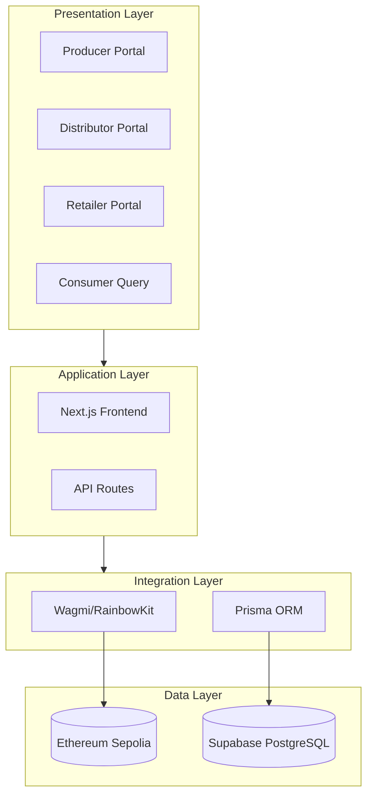

# Chapter 3: Methodology

This chapter describes the research methodology and technical approach employed to design and implement the FoodTrace proof-of-concept system. It explains the BMAD (Agile Blockchain DApp Engineering) development framework adapted for this 12-week thesis project (Section 3.1), justifies the selection of Ethereum over Hyperledger Fabric for the proof-of-concept context (Section 3.2), outlines the technical architecture including hybrid data storage strategy (Section 3.3), and defines the testing and validation approach ensuring code quality and functional correctness (Section 3.4). These methodological decisions establish the foundation for implementation detailed in Chapters 4 and 5.

## 3.1 BMAD Development Methodology

### 3.1.1 Development Framework

This project follows the ABCDE (Agile Block Chain DApp Engineering) framework, a blockchain-adapted agile methodology that separates development activities into two parallel flows: smart contract development and off-chain software development, each performed iteratively with integration activities every 2-3 iterations (Marchesi et al., 2020). This dual-flow approach addresses unique blockchain development challenges including transaction immutability, decentralized deployment, and consensus mechanism dependencies that differentiate blockchain engineering from conventional software development (ACM Computing Surveys, 2023).

The methodology incorporates Scrum principles (Schwaber & Sutherland, 2020) adapted for blockchain DApp development through iterative cycles focusing on incremental delivery and continuous validation. Each iteration follows a structured sequence: concept and requirements definition, prototyping and design, implementation with parallel smart contract and frontend development, testing and quality assurance, and deployment with user feedback integration (Pressman & Maxim, 2019).

Development utilizes AI-assisted tooling (Claude Code IDE) for code scaffolding, documentation generation, and workflow automation. However, all critical technical decisions—blockchain architecture design, smart contract security patterns, Web3 integration strategies, and platform selection trade-offs—were researched, analyzed, and validated by the development team through literature review and comparative analysis documented in Chapter 2.

### 3.1.2 Project Structure and Timeline

The project employs a 3-member team structure with defined primary responsibilities: Sam Chou leads blockchain development (smart contracts, architecture, security), TaiSheng Chen handles backend integration (API development, database design, Web3 connectivity), and YiLing Chen manages frontend implementation (UI design, responsive development, user experience).

The 12-week development timeline includes non-negotiable validation checkpoints preventing progression with inconsistent requirements or unstable infrastructure, as summarized in Table 9.

*Table 9 FoodTrace 12-week development timeline with validation checkpoints*

| Week | Phase | Key Deliverable | Checkpoint |
|------|-------|-----------------|------------|
| 0 | Pre-Kickoff | Documentation ready | - |
| 1-2 | Planning | PRD + Architecture validated | ✓ Week 2 |
| 3-4 | Smart Contracts | Sepolia deployment, >70% coverage | ✓ Week 4 |
| 5-7 | Frontend/Backend | 4 role interfaces, Web3 integration | ✓ Week 7 |
| 8-9 | Testing/Deployment | Complete POC deployed | ✓ Week 9 |
| 10-12 | Thesis Writing | 60+ page thesis submitted | - |

### 3.1.3 Risk Assessment

Blockchain-based food traceability systems face multiple risk categories requiring proactive mitigation strategies. Technical risks include smart contract vulnerabilities—given transaction immutability, bugs cannot be corrected without redeployment and data migration. Mitigation strategies include test-driven development achieving >70% code coverage, security audits using automated tools, and phased deployment from local testnet to Sepolia. Integration risks involve Web3 wallet connectivity failures creating poor user experience, mitigated through multiple provider support via RainbowKit and wallet-free consumer query functionality. Timeline risks from the aggressive 12-week schedule are addressed through ruthless scope prioritization to MVP features, mandatory quality gate checkpoints, and buffer time allocation in Weeks 8-9 for unforeseen challenges.

---

## 3.2 Platform Selection

### 3.2.1 Selection Criteria

The choice between Ethereum and Hyperledger Fabric required analysis of factors relevant to an academic proof-of-concept, informed by systematic literature reviews documenting blockchain adoption drivers and barriers in food supply chains (Saurabh & Dey, 2021; Rongonen, 2024). Platform selection frameworks emphasize evaluating transparency requirements, cost structures, throughput constraints, and technical complexity trade-offs (Zhao et al., 2019; Granillo-Macías et al., 2021).

Educational feasibility prioritizes platforms with extensive free learning resources and shorter onboarding times for developers unfamiliar with blockchain concepts. Development timeline constraints favor platforms with simple setup and deployment workflows suitable for 12-week academic schedules. Cost considerations evaluate both infrastructure expenses and transaction fees, particularly relevant for student thesis budgets. Transparency alignment assesses how well platform characteristics match thesis problem statement emphasizing consumer trust through public verification (Gálvez et al., 2018).

### 3.2.2 Decision Rationale

Ethereum was selected for this proof-of-concept based on multiple criteria, as summarized in Table 10.

*Table 10 Ethereum vs Hyperledger Fabric comparison for POC context*

| Criterion | Ethereum | Hyperledger Fabric |
|-----------|---------------------|-------------------|
| Learning Curve | 10-15 hours (Cyfrin Updraft) | 30+ hours (chaincode) |
| Setup Time | <30 minutes (Sepolia) | 40+ hours (consortium) |
| Infrastructure Cost | €0 (testnet faucets) | €50-100/month (cloud) |
| Transaction Cost | Gas fees (free on testnet) | None |
| Public Verification | Yes (Etherscan) | No (consortium access) |
| Throughput | 15-30 TPS | 3,000-10,000 TPS |
| Privacy Controls | Limited | GDPR-compliant |
| POC Suitability | ✓ Recommended | Enterprise-focused |

The thesis acknowledges Hyperledger Fabric's strengths in different contexts: enterprise B2B consortiums requiring privacy through GDPR-compliant identity management, high transaction throughput, and zero transaction costs (no gas fees). These advantages become relevant for production deployment scenarios but represent unnecessary complexity overhead for educational proof-of-concept focused on demonstrating blockchain traceability concepts rather than production scalability.

---

## 3.3 Technical Approach

### 3.3.1 System Architecture Overview

The FoodTrace system employs layered architecture separating presentation, application, integration, and data layers, as illustrated in Figure 6. The presentation layer includes four role-specific portals (Producer, Distributor, Retailer, Consumer) tailored to user workflows and information requirements. The application layer combines Next.js frontend with backend API routes in monolithic architecture, eliminating CORS complexity and simplifying deployment suitable for 3-person team collaboration. The integration layer handles Web3 connectivity through Wagmi v2 and RainbowKit, database access via Prisma ORM, and external services. The data layer spans Ethereum Sepolia testnet for immutable trace records and Supabase PostgreSQL for metadata and query caching.

<!-- Mermaid diagram for Excalidraw - export as PNG for Word -->

*Figure 6 FoodTrace layered system architecture*

This architecture balances simplicity appropriate for 12-week development timeline with production-ready patterns enabling future enhancement. Key architectural decisions include monolith versus microservices trade-offs (unified deployment versus independent scaling) and wallet-free consumer access (accessibility versus decentralization). Detailed implementation of these patterns is presented in Chapters 4 and 5.

### 3.3.2 Hybrid Data Strategy

The system employs hybrid data storage balancing blockchain immutability with off-chain efficiency, following architectural patterns documented in blockchain-based food supply chain frameworks (MDPI, 2023). Table 11 summarizes the data allocation strategy.

*Table 11 Hybrid data storage allocation*

| Data Category | Storage | Rationale |
|---------------|---------|-----------|
| Product registration | On-chain | Immutable proof of origin |
| Trace records | On-chain | Tamper-proof audit trail |
| Ownership transfers | On-chain | Verifiable custody changes |
| Product metadata | Off-chain | Frequent updates, cost efficiency |
| User authentication | Off-chain | Privacy, GDPR compliance |
| Search indexes | Off-chain | Query performance optimization |
| Cached blockchain data | Off-chain | Response speed improvement |

This hybrid approach addresses cost-efficiency constraints—storing all data on-chain incurs prohibitive gas costs while storing all data off-chain eliminates immutability benefits and prevents independent verification. The strategy achieves balance by storing only critical traceability data on-chain for tamper-proof transparency while maintaining flexible metadata off-chain. Implementation details including cryptographic linking mechanisms, gas cost optimizations, and data synchronization patterns are presented in Chapter 4.

---

## 3.4 Evaluation Methods

### 3.4.1 Testing Approach

The testing approach emphasizes risk-based prioritization across multiple test levels, following test-driven development principles demonstrated feasible for agile blockchain smart contract development (IEEE, 2024). The test pyramid strategy prioritizes unit testing volume over integration and end-to-end tests for optimal development velocity and defect detection efficiency.

Test categories include unit tests validating individual smart contract functions with >70% coverage target, integration tests validating multi-contract interactions and state consistency, end-to-end tests validating complete user workflows across UI, API, and blockchain layers, and non-functional requirements tests covering performance, security, and reliability. Quality gates enforce deterministic pass/fail rules before story closure, with test standards including no flaky tests, dynamic waiting strategies, stateless tests, and self-cleaning test data. Detailed test results and coverage analysis are presented in Chapter 6.

### 3.4.2 Performance Metrics

The project measures multiple performance dimensions validating acceptance criteria and identifying optimization opportunities, as summarized in Table 12.

*Table 12 Performance metrics categories and targets*

| Category | Metric | Target |
|----------|--------|--------|
| Blockchain | Block confirmation time | <30 seconds |
| Blockchain | Gas cost per function | Document actuals |
| Blockchain | Transaction success rate | >99% |
| Application | Page load time | <3 seconds |
| Application | API response time | <500ms |
| Quality | Smart contract coverage | >70% |
| Quality | TypeScript type coverage | >90% |
| UX | QR scan success rate | >95% |
| UX | Form validation feedback | <100ms |

Data collection methods combine quantitative data (blockchain transaction data from Etherscan API, application performance logs from Next.js middleware, automated test results from coverage tools) and qualitative data (UI/UX observations from team testing, workflow friction points, development process insights). All collected data is organized for thesis reference, directly informing Chapter 6 quantitative analysis and Chapter 7 qualitative discussion.

---

## References for Chapter 3

ACM Computing Surveys. (2023). Engineering blockchain-based software systems: Foundations, survey, and future directions. *ACM Computing Surveys*, 55(6). https://doi.org/10.1145/3530813

Gálvez, J. F., Mejuto, J. C., & Simal-Gandara, J. (2018). Future challenges on the use of blockchain for food traceability analysis. *TrAC Trends in Analytical Chemistry*, 107, 222-232. https://doi.org/10.1016/j.trac.2018.08.011

Granillo-Macías, R., González-Hernández, I. J., & Olivares-Benitez, E. (2021). Blockchain for agri-food supply chain traceability. In *Proceedings of the International Conference on Industrial Engineering and Operations Management* (pp. 1095-1103). Rome, Italy.

IEEE. (2024). Feasibility of test-driven development in agile blockchain smart contract development: A comprehensive analysis. *IEEE Conference Publication*, Document 10742781. IEEE Xplore.

Marchesi, L., Marchesi, M., & Tonelli, R. (2020). ABCDE—agile block chain DApp engineering. *Blockchain: Research and Applications*, 1(1-2), 100002. https://doi.org/10.1016/j.bcra.2020.100002

MDPI. (2023). Research on the construction of grain food multi-chain blockchain based on zero-knowledge proof. *Foods*, 12(8), 1600. https://doi.org/10.3390/foods12081600

Pressman, R. S., & Maxim, B. R. (2019). *Software engineering: A practitioner's approach* (9th ed.). McGraw-Hill Education.

Rongonen, A. (2024). *Blockchain technology in the food supply chains* [Bachelor's thesis, Aalto University]. Aalto University Digital Repository.

Saurabh, S., & Dey, K. (2021). Blockchain adoption in food supply chains: A review and implementation framework. *Production Planning & Control*, 32(10), 821-841. https://doi.org/10.1080/09537287.2021.1939902

Schwaber, K., & Sutherland, J. (2020). *The Scrum guide: The definitive guide to Scrum: The rules of the game*. Scrum.org. https://scrumguides.org/scrum-guide.html

Zhao, G., Liu, S., Lopez, C., Lu, H., Elgueta, S., Chen, H., & Boshkoska, B. M. (2019). Blockchain technology in agri-food value chain management: A synthesis of applications, challenges and future research directions. *Computers in Industry*, 109, 83-99. https://doi.org/10.1016/j.compind.2019.04.002

---

**Word Count:** ~1,700 words | **Tables:** 9-12 | **Figure:** 6 | **References:** 11
