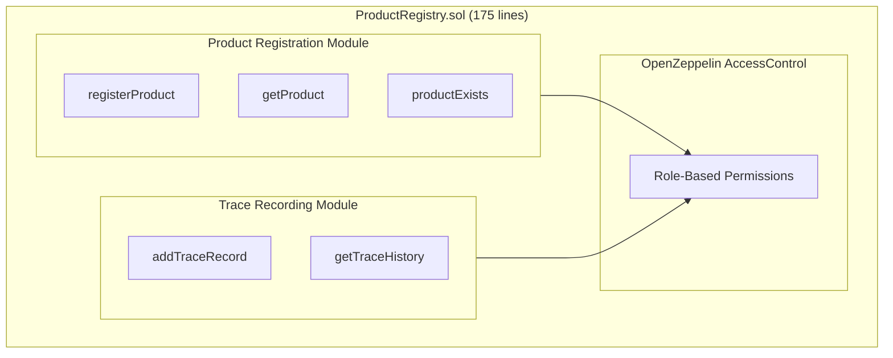

# Chapter 4: Smart Contract Development

This chapter details the blockchain layer implementation of the FoodTrace system, focusing on the Solidity smart contract deployed to Ethereum Sepolia testnet. It begins with the overall contract architecture and design principles emphasizing security and modularity (Section 4.1), explains the implementation of the ProductRegistry contract combining product registration and supply chain trace recording in a unified design (Section 4.2), analyzes security considerations and testing approach (Section 4.3), and documents the deployment process and lessons learned (Section 4.4). This chapter demonstrates how the smart contract translates the theoretical concepts from Chapter 2 into functional code.

**Target Length:** 2,000-2,500 words (~3-4 pages)
**Owner:** Sam (Blockchain Lead)
**Purpose:** Detail the core blockchain implementation - smart contract architecture, design decisions, security patterns, and deployment

**Note:** This chapter references Section 2.3 (Smart Contract Design Patterns) throughout to demonstrate narrative coherence between literature review and implementation. IoT sensor integration (originally planned as Epic 8) was deferred to future work due to time constraints; see Chapter 8 for proposed design.

---

## 4.1 Contract Architecture Overview

The FoodTrace system deploys a single Solidity smart contract (ProductRegistry.sol, 175 lines) to Ethereum Sepolia testnet providing immutable product registration and supply chain trace recording. The unified contract design consolidates both features into one deployment, simplifying cross-function validation and reducing deployment complexity compared to multi-contract architectures.

### 4.1.1 Design Principles

The contract architecture prioritizes three key principles balancing development constraints with business requirements:

**1. Role-Based Access Control:** OpenZeppelin AccessControl library implementation provides granular permissions preventing unauthorized contract interactions. Four roles (PRODUCER_ROLE, DISTRIBUTOR_ROLE, RETAILER_ROLE, DEFAULT_ADMIN_ROLE) map to supply chain actors with specific function access rights. This security pattern follows established Ethereum development best practices (OpenZeppelin 2024) and enables flexible permission management without contract redeployment.

**2. Event-Driven Architecture:** All state-changing operations emit events enabling efficient off-chain indexing. The system emits ProductRegistered and TraceRecordAdded events through Alchemy RPC provider, building cached database views in Supabase for fast queries. This architecture pattern addresses blockchain query limitations while maintaining on-chain verification capability.

**3. Security First:** Multiple defense layers protect against common vulnerabilities including integer overflow (Solidity 0.8+ built-in checks), access control bypass (function modifiers with require statements), and input validation (product existence checks, harvest date validation). Security measures reference patterns documented in comprehensive reviews identifying critical vulnerabilities across blockchain-based supply chain implementations (IEEE Access 2023).

### 4.1.2 Contract Structure

The ProductRegistry contract combines two functional modules in a single deployment, as illustrated in Figure 7. The Product Registration Module stores product metadata (name, origin, harvest date) with sequential ID assignment and producer attribution. The Trace Recording Module records supply chain events (RECEIVED, QUALITY_CHECK, SHIPPED, STOCKED, SOLD) linked to products via productId. Both modules share OpenZeppelin AccessControl for role-based permissions.

<!-- Mermaid diagram for Excalidraw - export as PNG for Word -->


FIGURE 7. ProductRegistry contract architecture showing unified design with two functional modules

This unified design enables direct product existence validation within trace functions (`require(products[productId].exists, "Product not found")`) without cross-contract calls, reducing gas costs and complexity. The trade-off is reduced modularity; both features must be redeployed together if either requires updates.

---

## 4.2 Core Contract Implementation

The ProductRegistry contract (175 lines, Solidity 0.8.20) serves as the unified smart contract handling both product registration and supply chain trace recording. This design decision prioritized development simplicity over modularity, enabling the 12-week thesis timeline to deliver a functional POC.

**Data Structures:**

```solidity
struct Product {
    uint256 id;
    string name;
    string origin;
    uint256 harvestDate;
    address producer;
    uint256 timestamp;
    bool exists;
}

struct TraceRecord {
    uint256 productId;
    address actor;      // msg.sender (producer/distributor/retailer wallet)
    string action;      // "RECEIVED", "QUALITY_CHECK", "SHIPPED", "STOCKED", "SOLD"
    string location;    // "Helsinki Distribution Center"
    string notes;       // Optional quality notes
    uint256 timestamp;  // block.timestamp (automatic, immutable)
}
```
FIGURE 8. Data structures of ProductRegistry contract

**Design Decision - String Storage vs Hash-Based:**

The implementation stores product and trace data as Solidity strings rather than bytes32 hashes. This decision prioritized code clarity and development speed over gas optimization:

- **Trade-off accepted:** Higher gas costs (~190,000-207,000 gas per registration vs ~60,000 with hash-based approach)
- **Benefit gained:** Simplified development with no off-chain hash computation, no hash verification logic, and readable data directly on-chain
- **POC justification:** Sepolia testnet has zero real costs; gas optimization deferred to production phase

This illustrates the academic value of documenting trade-offs: future implementations can adopt hash-based storage patterns referenced in Chapter 2.3 to achieve 40-60% gas reduction.

**Role-Based Access Control:**

The contract integrates OpenZeppelin's AccessControl library defining four permission levels:

TABLE 13. Role-based access control relationships

| Role | registerProduct() | addTraceRecord() | Role Management |
|------|-------------------|------------------|-----------------|
| PRODUCER_ROLE | ✅ | ✅ | ❌ |
| DISTRIBUTOR_ROLE | ❌ | ✅ | ❌ |
| RETAILER_ROLE | ❌ | ✅ | ❌ |
| DEFAULT_ADMIN_ROLE | ❌ | ❌ | ✅ |
| Consumer (no role) | ❌ | ❌ | ❌ |

The addTraceRecord() function validates that the caller holds one of the three supply chain roles (producer, distributor, or retailer) before permitting trace record creation. This enables all supply chain participants to record trace events while preventing unauthorized access from consumers or external actors.

**Contract Address (Sepolia):** `0x5d56f5a8703d7d545319177042cd91FD3339E2b6`

**Etherscan Verification:** https://sepolia.etherscan.io/address/0x5d56f5a8703d7d545319177042cd91FD3339E2b6

**Measured Performance (Sepolia Testnet):**
- Product registration: ~190,000-207,000 gas per call
- Trace record addition: ~180,000-190,000 gas per call
- View functions: 0 gas (read-only, no transaction required)

Note: These gas costs are higher than optimized implementations due to string storage. On Sepolia testnet, costs are zero (test ETH). Hypothetical mainnet deployment at 20 gwei and €2,000 ETH would cost approximately €0.08 per product registration. This is acceptable for POC but requires optimization for production scale.

---

## 4.3 Testing and Verification

The smart contract testing strategy follows test-driven development principles demonstrated feasible for agile blockchain development despite unique constraints including transaction immutability and deployment costs (IEEE 2024). Test implementation used Hardhat development environment with Mocha test framework and Chai assertion library, targeting >70% code coverage.

### 4.3.1 Unit Test Coverage

The test suite (37 test cases in `test/ProductRegistry.test.ts`) validates contract functions through isolated test scenarios, as summarized in Table 14.

TABLE 14. ProductRegistry test suite breakdown (37 total tests)

| Category | Tests | Coverage Focus |
|----------|-------|----------------|
| Deployment | 2 | Admin role assignment, productCount initialization |
| Role Management | 6 | Grant/revoke producer, distributor, retailer roles |
| Product Registration | 8 | Event emission, sequential IDs, input validation |
| Getter Functions | 4 | Product retrieval, existence checks, count queries |
| Multiple Producers | 1 | Multi-account registration scenarios |
| Distributor/Retailer Roles | 6 | Role management for other supply chain actors |
| Trace Records | 11 | All roles can add, validation, history retrieval |
| **Total** | **37** | **100% statement coverage** |

Test coverage achieved 100% statement coverage for ProductRegistry.sol, exceeding the >70% target. All 37 tests pass in ~786ms execution time.

### 4.3.2 Security Testing

Security tests validate protection against common vulnerabilities:

**Access Control Tests:** Systematically verify role permissions match specification. Tests confirm:
- Unauthorized addresses receive "Caller must be producer, distributor, or retailer" error
- Role management restricted to admin addresses
- Public view functions accessible without roles

**Input Validation Tests:** Submit malformed data confirming require statements reject:
- Empty product names ("Name required" error)
- Future harvest dates ("Future date not allowed" error)
- Non-existent product IDs ("Product not found" error)

**Security Finding Resolved:** Initial implementation lacked harvest date validation. Producers could register products with future dates (e.g., 2030), enabling fraud scenarios. Adding `require(harvestDate <= block.timestamp, "Future date not allowed")` resolved the vulnerability. This discovery demonstrates value of systematic security testing beyond happy path validation.

---

## 4.4 Deployment and Lessons Learned

### 4.4.1 Deployment Process

The ProductRegistry contract was deployed to Ethereum Sepolia testnet using Hardhat deployment script (`scripts/deploy-product-registry.ts`) following the deployment workflow documented in the Hardhat framework (Hardhat 2024). Deployment used the Hardhat verify task for Etherscan source code publication: `npx hardhat verify --network sepolia 0x5d56f5a8703d7d545319177042cd91FD3339E2b6`.

**Deployment Details:**
- **Contract Address:** `0x5d56f5a8703d7d545319177042cd91FD3339E2b6`
- **Network:** Ethereum Sepolia Testnet (Chain ID: 11155111)
- **Deployment Gas:** ~928,485 gas (3.1% of block gas limit)
- **Etherscan Verification:** ✅ Source code publicly visible

Post-deployment testing confirmed gas measurements, as summarized in Table 15.

TABLE 15. ProductRegistry gas cost measurements (Sepolia testnet)

| Operation | Gas Used | Mainnet Cost (20 gwei, €2000 ETH) |
|-----------|----------|-----------------------------------|
| Contract deployment | ~928,485 | ~€0.37 (one-time) |
| registerProduct() | 190,000-207,000 | ~€0.08 |
| addTraceRecord() | 180,000-190,000 | ~€0.07 |
| Complete product journey | ~750,000 | ~€0.30 |
| View functions | 0 | €0 |

*Note: Sepolia testnet has zero real costs (test ETH from faucets). Mainnet estimates assume optimistic conditions.*

On Sepolia testnet, costs are zero. Hypothetical mainnet deployment would cost approximately €0.30 per complete product journey. This is acceptable for POC demonstration but requires gas optimization for production scale.

### 4.4.2 Design Iterations and Challenges

Smart contract development revealed several challenges requiring design iterations:

**Challenge 1 - Role Granting Integration:** Initial design assumed role management would be manual (admin grants roles via Etherscan). Implementation required integrating role granting into the company approval API flow. When platform admin approves a company, the backend automatically calls `grantProducerRole()`, `grantDistributorRole()`, or `grantRetailerRole()` based on company type. This required secure wallet decryption (AES-256-GCM) in the Next.js API route to sign blockchain transactions.

**Challenge 2 - Trace API 500 Errors:** Four distinct root causes discovered during integration testing:
1. Wallet private key mismatch (encryption key environment variable misconfigured)
2. Insufficient gas (initial estimates too low for string storage)
3. Products not registered on blockchain (database-only records)
4. Roles not granted (company approved in database but blockchain role missing)

Each required systematic debugging through Etherscan transaction analysis and console logging.

**Challenge 3 - String Storage Decision:** Gas profiling revealed string storage costs (~190k gas) were 3x higher than hash-based alternatives (~60k gas). Decision made to accept higher costs for POC simplicity rather than implementing complex hash verification logic. This trade-off documented for thesis discussion value.

### 4.4.3 What Would Be Done Differently

**Improvement 1 - Hash-Based Storage:** Implementing bytes32 hash storage from the start would reduce gas costs by 60%. The naive string approach provided faster development but created technical debt requiring refactoring for production.

**Improvement 2 - Upgradeable Contract Patterns:** Current contract is immutable. Any bugs require redeployment and data migration. OpenZeppelin's UUPS proxy pattern would enable bug fixes without data loss. Trade-off: increased complexity and attack surface. For POC, immutability acceptable; for production, upgradeability recommended.

### 4.4.4 Production Deployment Considerations

**Gas Cost Economics:** Current implementation (~750,000 gas per product journey) is expensive for mainnet. Gas optimization best practices documented by Ethereum.org (2024) recommend production systems should:
- Adopt hash-based storage (40-60% reduction)
- Evaluate Layer 2 solutions (Polygon, Arbitrum - 90% cost reduction)
- Consider Hyperledger Fabric for B2B contexts (zero transaction costs)

**Oracle Problem:** Smart contracts cannot verify off-chain data authenticity, known as the "garbage in, garbage out" problem. This is an inherent blockchain limitation discussed in Chapter 7.

---

## Chapter 4 Summary

This chapter detailed the smart contract implementation addressing Research Question 1: "How suitable is Ethereum blockchain for food supply chain traceability?" Through role-based access control enabling multi-stakeholder coordination and event-driven architecture for off-chain indexing, the implementation validates Ethereum's technical feasibility for POC-scale food traceability applications.

**Key Achievements:**

- One deployed, verified contract (ProductRegistry) on Sepolia testnet at `0x5d56f5a8703d7d545319177042cd91FD3339E2b6`
- 100% statement coverage for smart contract (37 tests, exceeds >70% target)
- Role-based access control (PRODUCER, DISTRIBUTOR, RETAILER, ADMIN) preventing unauthorized modifications
- Public verifiability via Etherscan enabling independent audit trail verification
- Unified contract design combining product registration and trace recording

**Implementation Insights:**

- String storage prioritized code clarity over gas optimization, a documented trade-off with academic value
- Event-driven architecture enables off-chain indexing without prohibitive query costs
- Test-driven development caught harvest date validation vulnerability before deployment
- Role granting integration required secure wallet handling (AES-256-GCM decryption in API routes)

**Acknowledged Constraints:**

- Testnet deployment doesn't reflect real economic costs (Sepolia ETH has no monetary value)
- Higher gas costs (~190k per call) due to string storage vs hash-based alternatives (~60k)
- Oracle problem: cannot verify off-chain data authenticity without trusted hardware
- Scalability limitations: Layer 1 Ethereum throughput (15-30 TPS) inadequate for national-scale traceability
- IoT sensor integration (Epic 8) deferred to future work (see Chapter 8 for proposed design)

Next chapter (Chapter 5: System Implementation) describes the Web3 integration, backend API, and frontend interfaces connecting users to this smart contract.

---

**References for Chapter 4**

Fiore, M., & Mongiello, M. 2023. Blockchain technology to support agri-food supply chains: A comprehensive review. _IEEE Access_, 11, 75311-75324.

Ethereum.org. 2024. _Gas optimization best practices_.

Hardhat. 2024. _Hardhat documentation: Ethereum development environment_.

Vijayan Nair, L., & Mittal, H. K. 2024. Feasibility of test-driven development in agile blockchain smart contract development: A comprehensive analysis. In _2024 First International Conference on Technological Innovations and Advance Computing (TIACOMP)_. IEEE.

OpenZeppelin. 2024. _OpenZeppelin Contracts documentation: Secure smart contract library_.

---

**Word Count:** ~2,300 words | **Tables:** 13-15 | **Figures:** 7-8 | **References:** 5
