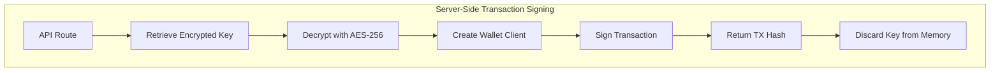
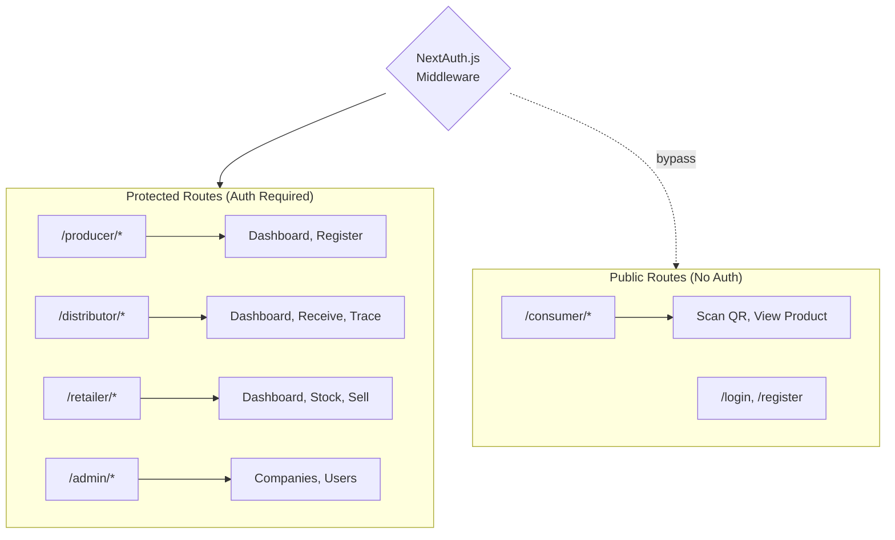
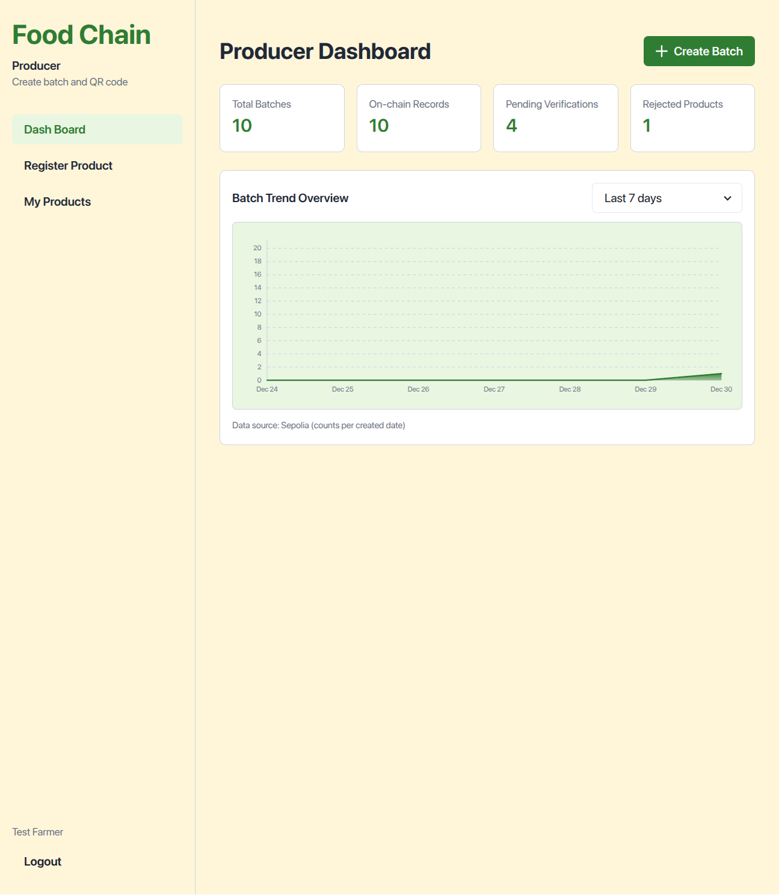
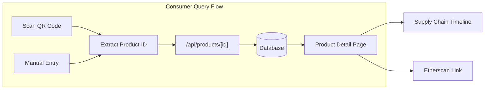
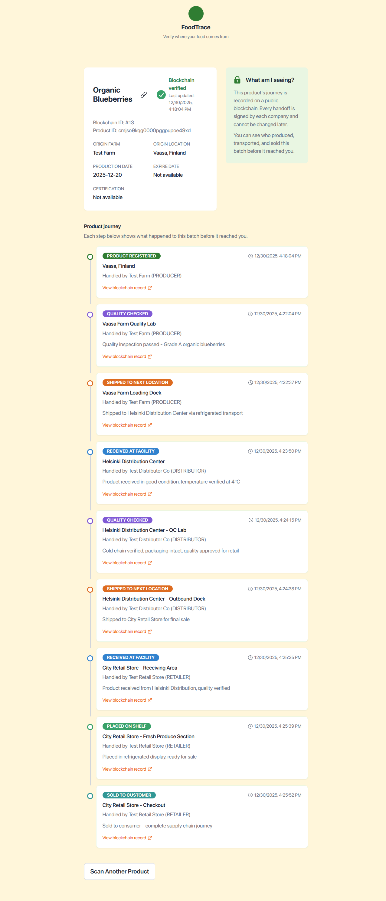

# Chapter 5: System Implementation

This chapter describes the implementation of the supporting system components that connect end users to the smart contract detailed in Chapter 4. It covers the backend architecture including database schema design, API route implementation, and Web3 integration using Wagmi v2 (Section 5.1), and explains the frontend development of role-specific user interfaces built with Next.js and Chakra UI (Section 5.2). Together, these components demonstrate how blockchain technology can be made accessible to mainstream users while maintaining the transparency and immutability benefits established in the literature review.

**Target Length:** 1,800-2,200 words (~4-5 pages)
**Owners:** TaiSheng (Backend), YiLing (Frontend)
**Purpose:** Detail the supporting system components connecting users to smart contract - backend API, Web3 integration, and frontend interfaces

**Note:** This chapter references:
- Section 2.4.1 (Custodial Wallet Patterns) → Backend correspondence
- Section 2.4.2 (Wallet-Free Consumer Access) → Frontend correspondence
- IoT sensor integration (Epic 8) was deferred to future work (see Chapter 8 for proposed design)

---

## 5.1 Backend Development

**Owner:** TaiSheng Chen

The backend architecture uses Next.js 14 API routes (Next.js 2024) for serverless functions combined with Supabase PostgreSQL for off-chain data storage and Wagmi v2 (Wagmi 2024) for blockchain interaction following modern Web3 development patterns.

**Note:** This section corresponds to Section 2.4.1 (Custodial Wallet Patterns) in Literature Review, which reviews custodial wallet patterns, Wagmi/Viem libraries, and API design best practices.

### 5.1.1 Database Schema (Prisma + Supabase)

The PostgreSQL database schema follows normalized relational database principles while accommodating blockchain data patterns, as summarized in Table 16.

TABLE 16. Database schema overview (Prisma + Supabase)

| Table | Purpose | Key Fields |
|-------|---------|------------|
| Product | Off-chain metadata linked to blockchain | blockchainId, name, origin, harvestDate, qrCodeUrl |
| TraceRecord | Cached blockchain trace events | action, location, notes, transactionHash |
| Company | Multi-tenancy with encrypted wallets | encryptedPrivateKey, walletAddress, type, status |
| User | Authentication with roles | email, passwordHash, role, companyId |
| AuditLog | System operations tracking | action, details, userId, companyId |

Each table includes blockchain-specific fields: transactionHash (links to Ethereum transaction), blockchainIndex (for trace ordering), and blockchainId (maps to smart contract product ID).

Foreign key relationships enforce referential integrity between Product, TraceRecord, User, and Company tables. Prisma ORM (Prisma 2024) manages schema evolution through declarative migrations with automatic rollback capabilities, providing type-safe database access and preventing SQL injection vulnerabilities. Connection pooling through Supabase's pgBouncer (TRANSACTION mode) prevents connection exhaustion in Next.js serverless environment where each API route invocation creates a new database client.

Database indexing strategy prioritizes consumer query performance: composite index on (Product.blockchainId, TraceRecord.createdAt) enables efficient trace history retrieval.

### 5.1.2 API Route Architecture

API routes follow REST conventions with domain-based organization: `/api/products/*` for product operations, `/api/admin/*` for platform administration, and `/api/companies/*` for company management. Each route implements authentication (NextAuth.js session validation), authorization (role-based access control), validation (Zod schema validation), business logic (Prisma database queries and Viem blockchain interactions), and error handling (structured responses with appropriate HTTP status codes). Core endpoints are summarized in Table 17.

TABLE 17. Core API endpoints

| Endpoint | Method | Purpose | Auth |
|----------|--------|---------|------|
| `/api/products/register` | POST | Register product to blockchain + DB | PRODUCER |
| `/api/products` | GET | List products with filtering | Authenticated |
| `/api/products/[id]` | GET | Retrieve product details | Public |
| `/api/products/[id]/trace` | POST | Add trace record to blockchain | Supply chain roles |
| `/api/products/[id]/trace-history` | GET | Retrieve complete trace history | Public |
| `/api/admin/companies/[id]/approve` | POST | Approve company + grant blockchain role | ADMIN |
| `/api/companies` | GET | List companies for recipient selection | Authenticated |

Performance optimization employs caching strategies: React Query on frontend caches blockchain read queries for 30 seconds, reducing redundant RPC calls and improving perceived performance.

### 5.1.3 Web3 Integration (Wagmi v2)

**Note:** This section applies custodial wallet patterns reviewed in Section 2.4.1 to address wallet UX barriers discussed in Section 2.4.2.

Web3 functionality implemented using Wagmi v2 library (Wagmi 2024) providing React hooks for Ethereum interaction, built on Viem (Viem 2024) for type-safe Ethereum operations. Configuration in `src/lib/wagmi.ts` defines Sepolia chain connection, Alchemy RPC provider (HTTP transport), and contract ABIs. Wagmi's createConfig initializes Web3 client with connection pooling and automatic retry logic for failed RPC requests.

**Custodial Wallet Pattern:**

Server-side blockchain interaction follows custodial wallet pattern: producer/distributor/retailer wallets stored encrypted (AES-256) in database, decrypted server-side for transaction signing. This eliminates frontend MetaMask requirements for business users while maintaining security through encryption-at-rest and HTTPS transport encryption. The transaction signing flow is illustrated in Figure 9.

<!-- Mermaid diagram for Excalidraw - export as PNG for Word -->

FIGURE 9. Custodial wallet transaction signing flow

**Wallet-Free Consumer Access:**

Consumer-facing queries use public RPC endpoints (no wallet required): frontend calls read-only contract methods via Wagmi's useReadContract hook, transparently connecting to Alchemy RPC without authentication. This enables wallet-free consumer product verification while maintaining blockchain transparency guarantees.

**Error Handling:**

Addresses common Web3 failure modes: RPC timeout (retry with exponential backoff), insufficient gas (estimate gas before transaction), nonce conflicts (serialize transactions per wallet), and contract revert (parse revert reason and return user-friendly message).

---

## 5.2 Frontend Development

**Owner:** YiLing Chen

**Note:** This section implements wallet-free access patterns reviewed in Section 2.4.2 (Wallet-Free Consumer Access) to address the 80% wallet setup abandonment rate documented in literature.

The frontend implements four role-specific interfaces (Producer, Distributor, Retailer, Consumer) using Next.js 14 Pages Router with TypeScript and Chakra UI v2 component library (Chakra UI 2024) for accessible, customizable React components following WAI-ARIA design patterns.

### 5.2.1 Layout Architecture and Routing

Application structure follows Next.js Pages Router conventions with file-based routing organized in the `pages/` directory. The root layout provides global Chakra UI theme provider and navigation wrapper. Role-specific dashboards organized under `/producer`, `/distributor`, `/retailer`, and `/trace` routes, each with dedicated layout components defining navigation sidebars and role-appropriate menu items. The application route structure with authentication boundaries is illustrated in Figure 10.

<!-- Mermaid diagram for Excalidraw - export as PNG for Word -->

FIGURE 10. Application route structure with authentication boundaries

Authentication state management uses NextAuth.js with Prisma adapter, storing user sessions in Supabase PostgreSQL. Protected routes implement middleware-based authentication checks: unauthenticated requests redirect to `/login`, and role-based authorization validates user permissions before rendering dashboard content. Consumer routes remain public (no authentication) to enable wallet-free product verification.

Responsive design implemented using Chakra UI's responsive style props: mobile-first breakpoints (base: 320px, md: 768px, lg: 1024px) ensure interfaces function on smartphones (primary device for QR scanning) through desktop browsers. Navigation collapses to hamburger menu on mobile, and data tables transform to card layouts for touch-friendly interaction.

### 5.2.2 Business User Interfaces (Producer, Distributor, Retailer)

All three business user dashboards share common architectural patterns while implementing role-specific workflows:

**Producer Dashboard** provides product registration form collecting product name, origin location, harvest date, weight, and product photo. Client-side validation using React Hook Form with Zod schema ensures data completeness before blockchain submission. Form submission triggers API request creating blockchain transaction and database record atomically. Transaction state feedback displays loading spinner during blockchain confirmation (12-15 second Sepolia block time), success message with product ID and QR code upon confirmation, and detailed error messages if transaction fails. Product list view displays registered products with thumbnails, action buttons for QR code generation (downloads 300x300px PNG using react-qr-code library), and transfer functionality to downstream partners. The Producer dashboard interface is shown in Figure 12.

FIGURE 11. Producer dashboard showing batch statistics, trend chart, and navigation for product registration and management.

**Distributor Dashboard** focuses on receiving products and adding trace records during transport/storage. Dashboard organized with tabs: "In Custody" (products currently owned) and "Product History" (previously handled products). "Incoming Shipments" section above tabs displays products shipped to this company with "Accept" button triggering RECEIVED trace. Trace record form provides action type selection (RECEIVED, QUALITY_CHECK, SHIPPED) with location and notes fields. Product detail view shows complete supply chain journey using vertical timeline component displaying all trace records chronologically with action badges, actor companies, locations, timestamps, and Etherscan links for blockchain verification.

**Retailer Dashboard** mirrors distributor functionality with retail-specific actions. Dashboard tabs: "In Stock" (products currently owned) and "Product History" (sold products). "Incoming Shipments" section displays products shipped from distributors. Trace actions include RECEIVED, STOCKED, and SOLD. When SOLD action recorded, product ownership transfers to null (no current owner), removing it from active inventory.

All business user interfaces implement optimistic UI updates showing pending operations before blockchain confirmation, reverting if transaction fails to provide responsive user experience despite blockchain latency.

### 5.2.3 Consumer Query Interface (Wallet-Free)

**Note:** This section directly addresses wallet complexity barriers reviewed in Section 2.4.2, implementing the wallet-free access pattern to solve the 80% abandonment rate problem.

Consumer query interface provides public product verification without authentication or wallet requirements, addressing wallet complexity barriers including seed phrase management and private key storage that deter mainstream consumer adoption. Empirical studies analyzing 45,821 app reviews of mobile cryptocurrency wallets document that both new and experienced users struggle with UX issues leading to frustration, disengagement, and dangerous errors including irreversible monetary losses (Voskobojnikov et al. 2021).

Primary entry point uses QR code scanning via html5-qrcode library: accesses device camera (requires HTTPS and user permission), decodes QR code, extracts product ID, and navigates to product detail page. Fallback manual entry allows consumers to type product ID directly if camera unavailable or QR code damaged. The consumer query flow is illustrated in Figure 11.

<!-- Mermaid diagram for Excalidraw - export as PNG for Word -->

FIGURE 12. Wallet-free consumer query flow with fallback manual entry

Product detail page fetches data via `/api/products/[id]/trace-history` endpoint (public read-only) and displays product identity (name, origin, harvest date), supply chain timeline with all trace records, and blockchain proof via Etherscan link for independent verification.

Mobile-optimized layout prioritizes information hierarchy: product identity and verification status above fold, supply chain timeline lazy-loaded on scroll, technical details (block numbers, transaction hashes) collapsed by default with "Show Technical Details" expand button. Page load time <2 seconds on 4G network achieved through Next.js Image component optimization (automatic WebP format conversion) and aggressive caching (stale-while-revalidate strategy). The complete consumer trace view interface is shown in Figure 13.

FIGURE 13. Consumer trace view showing complete product journey from Producer through Distributor to Retailer with blockchain verification links. Each trace record displays timestamp, location, actor company, and "View blockchain record" link for independent verification on Etherscan.

Accessibility features include ARIA labels for screen readers, keyboard navigation support for non-touch devices, and color-blind safe palette (blue/amber/red zones use patterns in addition to color for differentiation).

---

## Chapter 5 Summary

This chapter demonstrated the supporting system components connecting users to the smart contract detailed in Chapter 4. The implementation validates Research Question 4 "How can user experience challenges be addressed to enable broader blockchain adoption?" through:

**Key Achievements:**

The implementation delivers a custodial wallet pattern eliminating the MetaMask requirement for business users, alongside wallet-free consumer access via public RPC queries requiring no wallet installation. Role-based dashboards with tab navigation serve Producer, Distributor, and Retailer users, while QR code scanning for product lookup is implemented via the html5-qrcode library. The incoming shipments workflow includes recipient selection and accept functionality, with responsive mobile-first design optimized for QR scanning.

**Correspondence to Literature:**

The implementation corresponds directly to the literature review: Section 2.4.1 (Custodial Wallet Patterns) informed the custodial wallet implementation with AES-256-GCM encryption, while Section 2.4.2 (Wallet-Free Consumer Access) guided the consumer interface design requiring no wallet.

**Limitations Acknowledged:**

The custodial wallet pattern introduces centralization risk since the platform holds private keys. RPC provider centralization also exists with Alchemy serving as a single point of failure. IoT sensor integration was deferred to future work; see Chapter 8 for the proposed design.

Next chapter (Chapter 6: Results and Testing) presents performance metrics, test coverage results, and system validation.

---

## References for Chapter 5

Chakra UI. 2024. _Chakra UI Documentation_.

Next.js. 2024. _Next.js Documentation_. Vercel.

Prisma. 2024. _Prisma Documentation_.

Viem. 2024. _Viem Documentation_.

Voskobojnikov, A., et al. 2021. The U in crypto stands for usable: An empirical study of user experience with mobile cryptocurrency wallets. _CHI '21: CHI Conference on Human Factors in Computing Systems_.

Wagmi. 2024. _Wagmi Documentation_.

---

**Word Count:** ~2,000 words | **Tables:** 16-17 | **Figures:** 9-13 | **References:** 6
