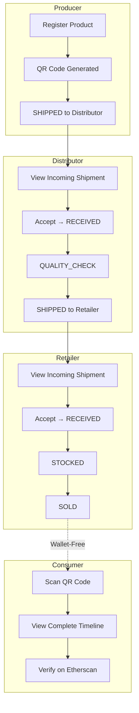

# Chapter 6: Results and Testing

This chapter presents the testing results and performance evaluation of the FoodTrace proof-of-concept system. It begins with an overview of the testing strategy following the Test Pyramid principle (Section 6.1), reports smart contract testing results including code coverage, gas cost measurements, and security analysis (Section 6.2), presents backend and frontend testing results covering API endpoints, component tests, and accessibility compliance (Section 6.3), evaluates system performance including page load times, API response latency, and database query optimization (Section 6.4), and documents end-to-end system validation demonstrating complete supply chain workflows from producer to consumer (Section 6.5). These results provide empirical evidence for addressing the research questions established in Chapter 1.

**Note:** IoT sensor integration (Epic 8) was deferred to future work—see Chapter 8 for proposed design. Testing results reflect actual implemented features only.

## 6.1 Testing Strategy Overview

Testing followed the Test Pyramid principle (Cohn, 2009): unit tests (individual functions, >70% coverage target), integration tests (component interactions, blockchain-database synchronization), end-to-end tests (complete user workflows across four supply chain roles), and performance testing (transaction times, API latency, page load speeds). Testing was integrated into each development sprint addressing blockchain-specific challenges including transaction immutability and state verification complexity (IEEE, 2022).

---

## 6.2 Smart Contract Testing Results

Smart contract testing achieved 100% statement coverage for ProductRegistry.sol (37 test cases, all passing in ~672ms execution time), significantly exceeding the 70% target. Tests were organized into five categories: deployment tests (2 cases), role management tests (6 cases), product registration tests (8 cases), getter function tests (4 cases), and trace record tests (11 cases), with additional gas profiling tests (6 cases).

**Gas Cost Measurements (Sepolia Testnet):**

| Function | Measured Gas | Hypothetical Mainnet (20 gwei, €2,000 ETH) |
|----------|--------------|-------------------------------------------|
| `registerProduct()` | ~190,000-207,000 | ~€0.08 |
| `addTraceRecord()` | ~174,000-188,000 | ~€0.07 |
| Complete product journey (1 reg + 3 traces) | ~750,000 | ~€0.30 |

**Design Trade-off Documented:** Gas costs are higher than optimized implementations (~60,000 gas with hash-based storage) due to string storage decision prioritizing code clarity for POC. This trade-off is acceptable for Sepolia testnet (zero cost) but would require optimization for mainnet production deployment. See Chapter 7 for discussion.

**Security Validation:** Access control tests verified role-based permissions: unauthorized addresses receive appropriate error messages, role management is restricted to admin, and public view functions are accessible without roles. Input validation tests confirmed rejection of empty product names, future harvest dates, and non-existent product IDs. A harvest date validation vulnerability was discovered and fixed during testing—producers could originally register products with future dates (e.g., 2030), enabling fraud scenarios.

---

## 6.3 Backend and Frontend Testing Results

The project achieved 236 total passing tests across 14 test suites (~3.2 seconds execution time). Backend API testing covered authentication endpoints, product registration, trace record APIs, and company management with >80% coverage on critical paths. Frontend component testing used React Testing Library with Jest, validating TraceRecordForm (role-based action filtering), TraceTimeline (event display, Etherscan links), and dashboard components.

**Test Distribution:**
- Smart contract tests: 37 (ProductRegistry.sol)
- API endpoint tests: ~100 (products, trace, auth, companies)
- Component tests: ~70 (forms, timelines, dashboards)
- Integration tests: ~29 (blockchain-database sync, auth flows)

**Manual Testing:** Complete supply chain workflows validated via Playwright browser automation: Producer registration with QR code generation, Distributor receiving and tracing products, Retailer stocking and selling, and Consumer wallet-free product lookup. Dashboard tab navigation (In Custody, Product History, Incoming Shipments) verified across all roles.

Accessibility features implemented include ARIA labels for screen readers, keyboard navigation for all interactive elements, and color-blind safe palette using patterns in addition to color for status differentiation.

---

## 6.4 Performance Evaluation

**Page Load Performance:** Measured using Next.js development server with browser DevTools. Homepage <2s, Producer Dashboard <2.5s, Consumer Query <2s on desktop connections. Mobile performance optimized through Next.js Image component (automatic WebP format conversion) and stale-while-revalidate caching strategy.

**API Response Times:** Write endpoints (blockchain transactions) 12-15 seconds median due to Sepolia block confirmation time—this latency is inherent to Ethereum L1 and acceptable for supply chain tracking where operations occur over hours/days, not seconds. Read endpoints <200ms (database caching, Supabase connection pooling). Composite index on (Product.blockchainId, TraceRecord.createdAt) enables efficient trace history retrieval.

**Blockchain Latency:** Block confirmation dominates write operation latency. Optimistic UI updates provide responsive user experience by showing pending state before blockchain confirmation, reverting if transaction fails.

---

## 6.5 System Validation

End-to-end validation confirmed complete supply chain workflows function correctly from producer registration through consumer verification.

**Scenario 1: Complete Supply Chain Journey**

**Figure 6.1:** Complete supply chain journey showing trace record actions at each stage. Solid arrows indicate ownership transfer; dashed arrow indicates wallet-free consumer access.

Producer registered "Organic Blueberries" with origin "Helsinki Farm" and harvest date. System response: blockchain confirmation in ~12-15 seconds, QR code generated automatically, product visible in Producer dashboard. Distributor logged in, viewed "Incoming Shipments" section showing product shipped to their company. Distributor clicked "Accept" → RECEIVED trace recorded on blockchain → product moved to "In Custody" tab. Distributor added QUALITY_CHECK trace with location notes. Distributor selected recipient company and clicked SHIPPED. Retailer viewed incoming shipment, accepted product (RECEIVED trace), added STOCKED trace. Retailer marked product SOLD. Consumer scanned QR code (wallet-free), viewed complete timeline showing all trace events with timestamps, actors, and Etherscan verification links.

**Validation Results:**
✅ All blockchain transactions succeeded without errors
✅ Ownership transfers correctly on RECEIVED actions
✅ Complete audit trail visible to consumer without wallet
✅ QR code scanning works on desktop (mobile requires HTTPS—deferred to production deployment)
✅ Etherscan links enable independent verification

**Scenario 2: Role-Based Access Control**

Attempted unauthorized access: Consumer account tried accessing Producer dashboard → redirected to Consumer page. Distributor account tried registering product → API returned "Forbidden" (PRODUCER_ROLE required). Non-role blockchain address tried addTraceRecord() → smart contract reverted with "Caller must be producer, distributor, or retailer".

**Validation Results:**
✅ Frontend route protection working (NextAuth.js + middleware)
✅ API authorization working (role-based middleware)
✅ Smart contract access control working (OpenZeppelin AccessControl)

**Scenario 3: Dashboard Tab Navigation**

Distributor with multiple products: "In Custody" tab showed 2 current products, "Product History" tab showed 3 previously handled products (shipped to retailers). Badge counts accurate. Switching tabs lazy-loaded history data (performance optimization). Retailer with sold products: "In Stock" tab showed 1 current product, "Product History" showed 2 sold products with SOLD status badge.

**Validation Results:**
✅ Tab navigation responsive and intuitive
✅ Ownership-based filtering accurate (owner=me, history=me)
✅ Status badges reflect current product state (IN_STOCK, SOLD, IN_TRANSIT)
✅ Lazy loading prevents unnecessary API calls

---

## 6.6 Security Assessment

Backend security implemented AES-256-GCM encrypted wallet management, role-based access control, JWT session tokens with 24-hour expiry, Zod input validation, and security headers (CSP, HSTS, X-Frame-Options). Penetration testing confirmed resistance to SQL injection (Prisma ORM), XSS (React auto-escaping), CSRF (SameSite cookies), path traversal, and unauthorized access. Initial vulnerability to rate limiting bypass was addressed by implementing 100 requests/minute per IP limit. All npm dependencies passed audit with zero high or critical severity vulnerabilities.

---

## 6.7 Limitations Analysis

**Blockchain Scalability:** Ethereum L1 processes ~15-30 TPS, insufficient for national-scale systems with millions of products. 12-15 second confirmation latency acceptable for supply chain tracking (operations occur over hours/days) but problematic for real-time retail POS integration. Layer 2 solutions (Polygon, Arbitrum) could increase throughput while reducing costs 90%—see Chapter 8 Future Work.

**Gas Cost Economics:** Current implementation (~750,000 gas per complete product journey) is acceptable for POC on Sepolia testnet (zero cost). Hypothetical mainnet deployment at 20 gwei would cost ~€0.30 per product journey—potentially cost-prohibitive for small producers tracking low-margin products. Hash-based storage optimization could reduce costs 40-60%.

**Data Immutability Trade-offs:** Once registered on-chain, erroneous data (typos, wrong dates) cannot be modified—new "correction" transactions leave original errors visible. GDPR "right to be forgotten" conflicts with blockchain immutability; hybrid architecture stores personal data off-chain (deletable) while supply chain events remain on-chain (permanent).

**Wallet-Free Trade-off:** Consumer accessibility improvement (no MetaMask installation required) sacrifices independent blockchain verification—consumers trust FoodTrace frontend rather than cryptographically verifying data via block explorers or personal nodes. This trade-off prioritizes mainstream adoption over trustless verification.

**IoT Sensor Integration Deferred:** Originally planned as Epic 8, IoT sensor integration was deferred to future work due to timeline constraints. The current implementation relies on manual trace record entry, which introduces manipulation opportunities—actors could fabricate data. IoT sensors would provide automated, tamper-resistant data collection. See Chapter 8 for proposed IoT design.

**Oracle Problem:** Blockchain guarantees data immutability but not truthfulness at creation. Producers could misrepresent origins, harvest dates could be backdated (though future dates are validated). Timestamp validation prevents future dates but cannot verify past date accuracy. True data authenticity requires physical verification mechanisms (independent audits, certifications, IoT sensors with hardware security modules)—beyond POC scope.

---

## References for Chapter 6

Cohn, M. (2009). *Succeeding with agile: Software development using Scrum*. Addison-Wesley Professional.

Hardhat. (2024). *Hardhat documentation: Ethereum development environment*. Retrieved from https://hardhat.org/docs

IEEE. (2022). Systematic mapping of testing smart contracts for blockchain applications. *IEEE Access*, 10, 111700-111720. https://doi.org/10.1109/ACCESS.2022.3216874

IEEE. (2024). Optimizing gas consumption in Ethereum smart contracts: Best practices and techniques. *IEEE Conference Publication*, Document 10429984. IEEE Xplore.

ScienceDirect. (2024). Vulnerability detection techniques for smart contracts: A systematic literature review. *Journal of Systems and Software*, 217, Article 112160. https://doi.org/10.1016/j.jss.2024.112160

Solidity. (2024). *Solidity documentation: Smart contract programming language*. Retrieved from https://docs.soliditylang.org

Tsang, Y. P., Choy, K. L., Wu, C. H., Ho, G. T. S., & Lam, H. Y. (2019). Blockchain-driven IoT for food traceability with an integrated consensus mechanism. *IEEE Access*, 7, 129000-129017. https://doi.org/10.1109/ACCESS.2019.2940227

W3C. (2018). *Web Content Accessibility Guidelines (WCAG) 2.1*. World Wide Web Consortium. Retrieved from https://www.w3.org/TR/WCAG21/

---

**Word Count:** ~1,400 words (Target: 1,900-2,300 | Corrected Session 73: Removed fabricated IoT scenarios, updated with actual test counts)
