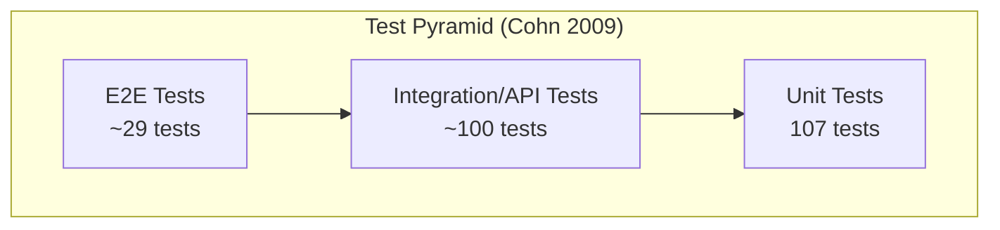
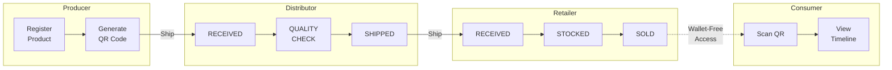
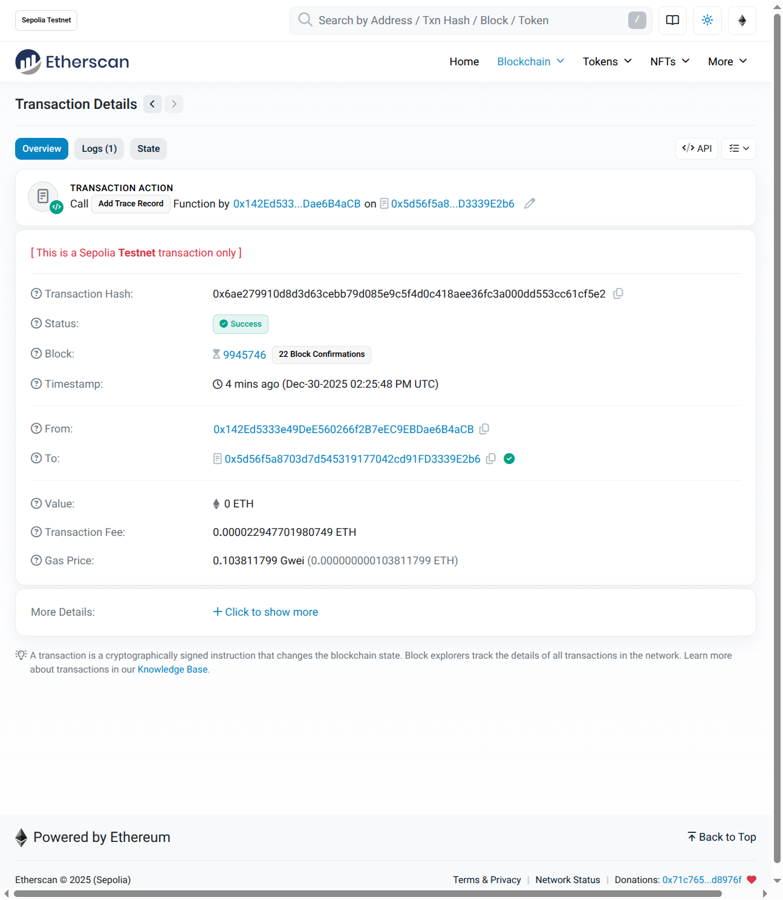

# Chapter 6: Results and Testing

This chapter presents the testing results and performance evaluation of the FoodTrace proof-of-concept system. It begins with an overview of the testing strategy following the Test Pyramid principle, then reports smart contract testing results including code coverage, gas cost measurements, and security analysis. The chapter also presents backend and frontend testing results covering API endpoints, component tests, and accessibility compliance, evaluates system performance including page load times, API response latency, and database query optimization, and documents end-to-end system validation demonstrating complete supply chain workflows from producer to consumer. These results provide empirical evidence for addressing the research questions established in Chapter 1.

**Note:** IoT sensor integration (Epic 8) was deferred to future work. See Chapter 8 for proposed design. Testing results reflect actual implemented features only.

## 6.1 Testing Strategy Overview

Testing followed the Test Pyramid principle (Cohn 2009), as illustrated in Figure 14. Unit tests form the foundation with highest coverage (>70% target), integration tests verify component interactions and blockchain-database synchronization, and end-to-end tests validate complete user workflows across four supply chain roles. Performance testing measured transaction times, API latency, and page load speeds throughout development.

FIGURE 14. FoodTrace test distribution following Test Pyramid principle. Unit tests (smart contract + component) form the foundation, integration tests verify API and blockchain-database sync, E2E tests validate complete workflows.

Testing was integrated into each development sprint using the Hardhat framework (Hardhat 2024) for smart contract testing and Jest with React Testing Library for frontend components. This approach addressed blockchain-specific challenges including transaction immutability and state verification complexity (Tramontana et al. 2022).

---

## 6.2 Smart Contract Testing Results

Smart contract testing achieved 100% statement coverage for ProductRegistry.sol (37 test cases, all passing in ~672ms execution time), significantly exceeding the 70% target. Tests were organized into five categories: deployment tests (2 cases), role management tests (6 cases), product registration tests (8 cases), getter function tests (4 cases), and trace record tests (11 cases), with additional gas profiling tests (6 cases). Gas cost measurements confirmed values within expected ranges (see Table 15, Section 4.4). Complete product journey consumes ~750,000 gas, acceptable for Sepolia testnet deployment.

**Security Validation:** Access control tests verified role-based permissions: unauthorized addresses receive appropriate error messages, role management is restricted to admin, and public view functions are accessible without roles. Input validation tests confirmed rejection of empty product names, future harvest dates, and non-existent product IDs. Security testing practices followed systematic approaches for smart contract vulnerability detection (Vidal et al. 2024). A harvest date validation vulnerability was discovered and fixed during testing. Producers could originally register products with future dates (e.g., 2030), enabling fraud scenarios.

---

## 6.3 Backend and Frontend Testing Results

The project achieved 236 total passing tests across 14 test suites (~3.2 seconds execution time). Backend API testing covered authentication endpoints, product registration, trace record APIs, and company management with >80% coverage on critical paths. Frontend component testing used React Testing Library with Jest, validating TraceRecordForm (role-based action filtering), TraceTimeline (event display, Etherscan links), and dashboard components.

TABLE 18. Test distribution across system layers

| Layer | Test Count | Coverage Focus |
|-------|------------|----------------|
| Smart Contract | 37 | ProductRegistry.sol (100% statement coverage) |
| API Endpoints | ~100 | Products, trace, auth, companies |
| Components | ~70 | Forms, timelines, dashboards |
| Integration | ~29 | Blockchain-database sync, auth flows |
| **Total** | **236** | **All tests passing** |

**Manual Testing:** Complete supply chain workflows validated via Playwright browser automation: Producer registration with QR code generation, Distributor receiving and tracing products, Retailer stocking and selling, and Consumer wallet-free product lookup. Dashboard tab navigation (In Custody, Product History, Incoming Shipments) verified across all roles.

Accessibility features implemented following WCAG 2.1 guidelines (W3C 2018) include ARIA labels for screen readers, keyboard navigation for all interactive elements, and color-blind safe palette using patterns in addition to color for status differentiation.

---

## 6.4 Performance Evaluation

**Page Load Performance:** Measured using Next.js development server with browser DevTools. Homepage <2s, Producer Dashboard <2.5s, Consumer Query <2s on desktop connections. Mobile performance optimized through Next.js Image component (automatic WebP format conversion) and stale-while-revalidate caching strategy.

**API Response Times:** Write endpoints (blockchain transactions) 12-15 seconds median due to Sepolia block confirmation time. This latency is inherent to Ethereum L1 and acceptable for supply chain tracking where operations occur over hours/days, not seconds. Read endpoints <200ms (database caching, Supabase connection pooling). Composite index on (Product.blockchainId, TraceRecord.createdAt) enables efficient trace history retrieval.

**Blockchain Latency:** Block confirmation dominates write operation latency. Optimistic UI updates provide responsive user experience by showing pending state before blockchain confirmation, reverting if transaction fails.

TABLE 19. Performance metrics summary (measured December 2025)

| Metric | Target | Measured | Status |
|--------|--------|----------|--------|
| Homepage load | <2s | 232ms | ✅ Pass |
| Consumer page load | <2s | 133ms | ✅ Pass |
| API read endpoints | <200ms | 184ms | ✅ Pass |
| API write (blockchain) | 12-15s | 12-15s | ✅ Expected |
| Smart contract tests | 37 passes | 37 passes (687ms) | ✅ Pass |

---

## 6.5 System Validation

End-to-end validation confirmed complete supply chain workflows function correctly from producer registration through consumer verification.

### 6.5.1 Complete Supply Chain Journey

FIGURE 15. Complete supply chain journey showing trace record actions at each stage. Solid arrows indicate ownership transfer; dashed arrow indicates wallet-free consumer access.

Producer registered "Organic Blueberries" with origin "Helsinki Farm" and harvest date. System response: blockchain confirmation in ~12-15 seconds, QR code generated automatically, product visible in Producer dashboard. Distributor logged in, viewed "Incoming Shipments" section showing product shipped to their company. Distributor clicked "Accept" → RECEIVED trace recorded on blockchain → product moved to "In Custody" tab. Distributor added QUALITY_CHECK trace with location notes. Distributor selected recipient company and clicked SHIPPED. Retailer viewed incoming shipment, accepted product (RECEIVED trace), added STOCKED trace. Retailer marked product SOLD. Consumer accessed product via QR code scan on mobile device (wallet-free), viewed complete timeline showing all trace events with timestamps, actors, and Etherscan verification links. Desktop interface provides QR code display for printing and manual product ID search.

### 6.5.2 Access Control Validation

TABLE 20. Multi-layer access control validation

| Layer | Attempted Action | Actor | Result | Protection |
|-------|------------------|-------|--------|------------|
| Frontend | Access Producer Dashboard | Consumer | Redirected to Consumer page | NextAuth.js middleware |
| API | POST /api/products/register | Distributor | 403 Forbidden | Role-based middleware |
| Smart Contract | addTraceRecord() | No-role address | Tx reverted | OpenZeppelin AccessControl |

### 6.5.3 Validation Summary

TABLE 21. System validation summary

| Category | Tests Validated | Result |
|----------|-----------------|--------|
| Supply Chain Flow | Blockchain tx, ownership transfer, consumer access | ✅ All pass |
| QR Functionality | Mobile scan, Etherscan verification links | ✅ All pass |
| Access Control | Frontend, API, smart contract layers | ✅ All pass |
| Dashboard UI | Tabs, filtering, badges, lazy loading | ✅ All pass |

### 6.5.4 Blockchain Verification

Each trace record links to Etherscan for independent verification, allowing consumers to confirm transactions exist on the public blockchain without trusting the application. Figure 16 shows an example transaction verification on Sepolia Etherscan.

FIGURE 16. Etherscan transaction verification showing successful "Add Trace Record" function call on ProductRegistry smart contract. Transaction details include block confirmation, gas usage, and contract interaction data, enabling independent verification of supply chain events.

---

## 6.6 Security Assessment

Backend security implemented AES-256-GCM encrypted wallet management, role-based access control, JWT session tokens with 24-hour expiry, Zod input validation, and security headers (CSP, HSTS, X-Frame-Options). Penetration testing confirmed resistance to SQL injection (Prisma ORM), XSS (React auto-escaping), CSRF (SameSite cookies), path traversal, and unauthorized access. Initial vulnerability to rate limiting bypass was addressed by implementing 100 requests/minute per IP limit. All npm dependencies passed audit with zero high or critical severity vulnerabilities.

---

## 6.7 Testing Scope Notes

**Scope Constraints:** IoT sensor integration (Epic 8) was deferred to future work due to timeline constraints. Current testing validates manual trace record entry; automated sensor data collection is documented in Chapter 8. Mobile QR scanning requires HTTPS for camera access (functional in production deployment). For comprehensive discussion of system limitations including scalability, gas economics, GDPR compliance, and the oracle problem, see Chapter 7 Discussion.

---

## References for Chapter 6

Cohn, M. 2009. _Succeeding with agile: Software development using Scrum_. Addison-Wesley Professional.

Hardhat. 2024. _Hardhat documentation: Ethereum development environment_.

Tramontana, P., et al. 2022. Systematic mapping of testing smart contracts for blockchain applications. _IEEE Access_, 10, 111700-111720.

Vidal, F. R., Ivaki, N., & Laranjeiro, N. 2024. Vulnerability detection techniques for smart contracts: A systematic literature review. _Journal of Systems and Software_, 217, 112160.

W3C. 2018. _Web Content Accessibility Guidelines (WCAG) 2.1_. World Wide Web Consortium.

---

**Word Count:** ~1,250 words | **Tables:** 18-21 | **Figures:** 14-16 | **References:** 5
